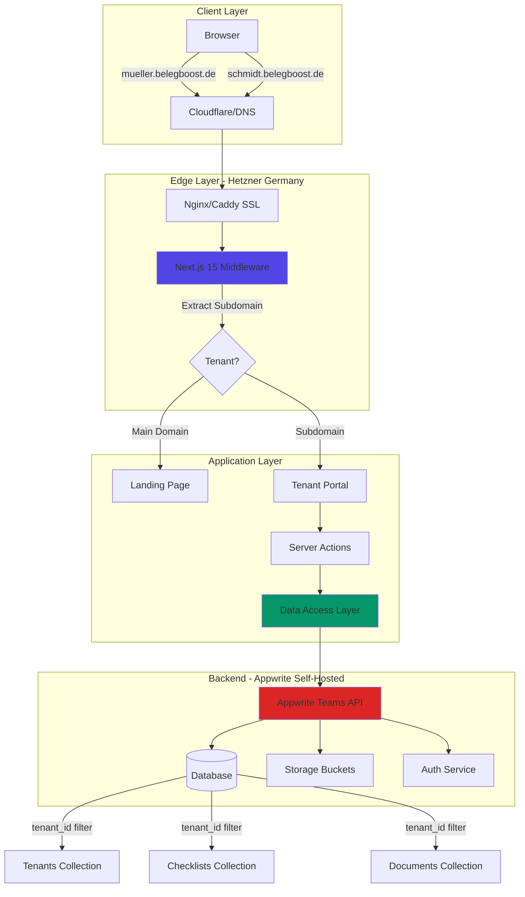
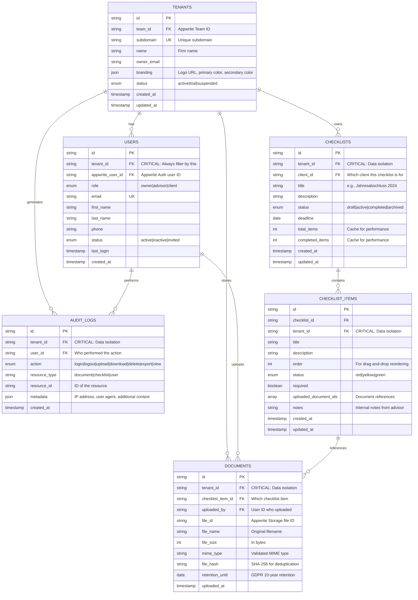

## 📋 Overview

BelegBoost is a multi-tenant B2B SaaS application designed for German tax advisors (Steuerberater) and their clients (Mandanten). The platform enables checklist management with document uploads and status tracking via a traffic light system. Each tax advisor operates their own branded subdomain (`[berater-domain].belegboost.de`) where both the advisor and their clients can log in to manage checklists and financial documents.

**Target Market:** German tax advisory firms (DACH region)
**Compliance:** GDPR, BDSG (German Federal Data Protection Act), BSI IT-Grundschutz
**Tech Stack:** Next.js 15, React 19, TypeScript, Tailwind CSS 4, shadcn/ui, Appwrite (self-hosted)
**Deployment:** Hetzner Germany (GDPR compliance)
**Timeline:** 18 weeks (4.5 months) across 7 implementation phases

---

## 🎯 Problem Statement

Tax advisors currently lack a centralized, secure platform to:
- Manage document collection from clients with clear status tracking
- Track checklist completion status with visual indicators (traffic light system)
- Provide clients with self-service document upload capabilities
- Maintain strict data isolation between different advisory firms
- Ensure GDPR compliance for sensitive financial data (10-year retention)

Each advisory firm needs their own branded portal without the complexity of managing separate deployments. The subdomain-based multi-tenancy approach provides tenant isolation while maintaining a single codebase and deployment.

---

## 💡 Proposed Solution

Build a greenfield Next.js 15 application with subdomain-based multi-tenancy using:
- **Frontend:** Next.js 15.5.5, TypeScript 5 (strict mode), Tailwind CSS 4, shadcn/ui
- **Backend:** Appwrite 1.5+ (Auth, Database, Storage) - self-hosted
- **Architecture:** Single deployment serving all tenants via middleware-based routing
- **Deployment:** Self-hosted on Hetzner Germany for full GDPR compliance

### Domain Structure
```
belegboost.de                           → Main landing + tax advisor registration
[berater-subdomain].belegboost.de      → Tax advisor portal with custom branding
```

**Example Flow:**
1. Tax advisor "Müller Steuerberatung" registers at `belegboost.de`
2. Chooses subdomain: `mueller`
3. Portal available at `mueller.belegboost.de` with custom logo and colors
4. Advisor invites clients who access the same subdomain
5. All data strictly isolated per tenant using Appwrite Teams API

---

## 🏗️ Technical Approach

### Architecture Overview



### Multi-Tenancy Model

**Subdomain-Based Tenant Isolation:**
- Next.js 15 middleware detects subdomain from request headers
- Single Next.js deployment serves all tenants dynamically
- Appwrite Teams API provides backend tenant isolation
- Each query MUST filter by `tenant_id` (enforced via Data Access Layer)

**Security Pattern (Defense-in-Depth):**
```
┌─────────────────────────────────────────────────────────┐
│ Layer 1: Middleware - Subdomain validation             │
├─────────────────────────────────────────────────────────┤
│ Layer 2: Server Actions - Tenant context validation    │
├─────────────────────────────────────────────────────────┤
│ Layer 3: Data Access Layer - Automatic tenant_id filter│
├─────────────────────────────────────────────────────────┤
│ Layer 4: Appwrite Teams - Permission enforcement       │
└─────────────────────────────────────────────────────────┘
```

### Routing Strategy

```
app/
├── (main)/                      # belegboost.de - Main domain
│   ├── page.tsx                 # Landing page
│   ├── register/                # Tax advisor registration
│   ├── pricing/                 # Pricing information
│   ├── impressum/               # Legal imprint (required by German law)
│   └── datenschutz/             # Privacy policy (GDPR requirement)
│
├── tenants/
│   └── [tenant]/                # [berater].belegboost.de - Tenant subdomains
│       ├── (auth)/
│       │   ├── login/           # Tenant-specific login
│       │   └── einladung/       # Client invitation acceptance
│       │
│       ├── (dashboard)/
│       │   ├── page.tsx         # Dashboard with overview
│       │   ├── checklisten/     # Checklist management
│       │   │   ├── page.tsx     # List all checklists
│       │   │   ├── [id]/        # Checklist detail view
│       │   │   └── neu/         # Create new checklist
│       │   ├── dokumente/       # Document library
│       │   ├── mandanten/       # Client management (advisor only)
│       │   └── einstellungen/   # Settings
│       │       ├── profil/      # User profile
│       │       ├── branding/    # Tenant branding (advisor only)
│       │       └── daten/       # Data export/deletion (GDPR)
│       │
│       └── layout.tsx           # Tenant branding wrapper
│
├── middleware.ts                # Subdomain detection & routing
└── api/
    └── webhooks/
        └── appwrite/            # Appwrite webhook handlers
```

### Database Schema (Appwrite Collections)



**Index Strategy (Performance):**
- `tenant_id` on ALL collections (CRITICAL for query performance)
- `tenant_id + status` on checklists
- `tenant_id + client_id` on checklists
- `tenant_id + uploaded_by` on documents
- `tenant_id + action + created_at` on audit_logs

---

## 🔐 Critical Security Patterns

### 1. Data Access Layer (DAL) Pattern

**CRITICAL: All database queries MUST go through the DAL to enforce tenant filtering**

```typescript
// lib/dal/checklists.ts
'use server'

import { databases } from '@/lib/server/appwrite';
import { getTenantContext } from '@/lib/server/tenant';
import { Query } from 'node-appwrite';

const DATABASE_ID = process.env.APPWRITE_DATABASE_ID!;
const CHECKLISTS_COLLECTION = process.env.APPWRITE_CHECKLISTS_COLLECTION!;

/**
 * CRITICAL: This function ALWAYS filters by tenant_id
 * Never bypass this - it prevents data leakage between tenants
 */
export async function getChecklists() {
  const { tenantId } = await getTenantContext();

  // SECURITY: tenant_id filter is REQUIRED
  return await databases.listDocuments(
    DATABASE_ID,
    CHECKLISTS_COLLECTION,
    [
      Query.equal('tenant_id', tenantId),
      Query.orderDesc('created_at')
    ]
  );
}

export async function getChecklistById(checklistId: string) {
  const { tenantId } = await getTenantContext();

  const checklist = await databases.getDocument(
    DATABASE_ID,
    CHECKLISTS_COLLECTION,
    checklistId
  );

  // SECURITY: Verify the checklist belongs to this tenant
  if (checklist.tenant_id !== tenantId) {
    throw new Error('Unauthorized: Checklist not found');
  }

  return checklist;
}
```

### 2. Middleware Pattern (Subdomain Detection)

```typescript
// middleware.ts
import { NextRequest, NextResponse } from 'next/server';

export const config = {
  matcher: [
    '/((?!api|_next/static|_next/image|favicon.ico).*)',
  ],
};

export function middleware(request: NextRequest) {
  const hostname = request.headers.get('host') || '';
  const url = request.nextUrl;

  // Handle localhost development
  let subdomain = '';

  if (hostname.includes('localhost') || hostname.includes('127.0.0.1')) {
    // For local dev: tenant.belegboost.local:3000
    subdomain = hostname.split('.')[0];

    if (subdomain === 'localhost' || subdomain === '127') {
      subdomain = '';
    }
  } else {
    // Production: tenant.belegboost.de
    const parts = hostname.split('.');

    if (parts.length >= 3) {
      subdomain = parts[0];
    }
  }

  // Main domain (no subdomain) - show landing page
  if (!subdomain || subdomain === 'www' || subdomain === 'belegboost') {
    return NextResponse.next();
  }

  // Rewrite to tenant routes
  url.pathname = `/tenants/${subdomain}${url.pathname}`;

  return NextResponse.rewrite(url);
}
```

### 3. Server Action Pattern (Tenant Context Validation)

```typescript
// actions/checklists.ts
'use server'

import { getTenantContext } from '@/lib/server/tenant';
import { createChecklist as dalCreateChecklist } from '@/lib/dal/checklists';
import { checklistSchema } from '@/lib/validations/checklist';
import { revalidatePath } from 'next/cache';

export async function createChecklist(formData: FormData) {
  // 1. Get tenant context (includes auth check)
  const { tenantId, userId, role } = await getTenantContext();

  // 2. Validate role permissions
  if (role !== 'owner' && role !== 'advisor') {
    throw new Error('Unauthorized: Only advisors can create checklists');
  }

  // 3. Validate input
  const rawData = {
    title: formData.get('title'),
    description: formData.get('description'),
    client_id: formData.get('client_id'),
    deadline: formData.get('deadline'),
  };

  const validatedData = checklistSchema.parse(rawData);

  // 4. Create checklist (DAL automatically adds tenant_id)
  const checklist = await dalCreateChecklist({
    ...validatedData,
    tenant_id: tenantId,
    created_by: userId,
  });

  // 5. Revalidate cache
  revalidatePath('/checklisten');

  return { success: true, checklist };
}
```

### 4. File Upload Security Pattern

```typescript
// lib/validations/file.ts
import { z } from 'zod';

const ALLOWED_MIME_TYPES = [
  'application/pdf',
  'image/jpeg',
  'image/png',
  'application/vnd.openxmlformats-officedocument.spreadsheetml.sheet', // .xlsx
  'application/vnd.openxmlformats-officedocument.wordprocessingml.document', // .docx
];

const MAX_FILE_SIZE = 10 * 1024 * 1024; // 10MB

export const fileUploadSchema = z.object({
  file: z.instanceof(File)
    .refine((file) => file.size <= MAX_FILE_SIZE, {
      message: 'Datei ist zu groß (max. 10MB)',
    })
    .refine((file) => ALLOWED_MIME_TYPES.includes(file.type), {
      message: 'Dateityp nicht erlaubt. Nur PDF, JPG, PNG, XLSX, DOCX',
    }),
});

// actions/documents.ts
'use server'

import { getTenantContext } from '@/lib/server/tenant';
import { storage } from '@/lib/server/appwrite';
import { fileUploadSchema } from '@/lib/validations/file';
import { ID } from 'node-appwrite';

export async function uploadDocument(formData: FormData) {
  const { tenantId, userId } = await getTenantContext();

  const file = formData.get('file') as File;
  const checklistItemId = formData.get('checklist_item_id') as string;

  // Validate file
  fileUploadSchema.parse({ file });

  // SECURITY: Verify magic bytes (not just MIME type)
  const buffer = await file.arrayBuffer();
  const uint8Array = new Uint8Array(buffer);

  if (!validateMagicBytes(uint8Array, file.type)) {
    throw new Error('Dateityp stimmt nicht mit Inhalt überein');
  }

  // Upload to tenant-specific bucket
  const bucketId = `tenant-${tenantId}`;

  const uploadedFile = await storage.createFile(
    bucketId,
    ID.unique(),
    file
  );

  // Create document record with audit trail
  await createDocumentRecord({
    tenant_id: tenantId,
    uploaded_by: userId,
    checklist_item_id: checklistItemId,
    file_id: uploadedFile.$id,
    file_name: file.name,
    file_size: file.size,
    mime_type: file.type,
  });

  return { success: true, fileId: uploadedFile.$id };
}

function validateMagicBytes(bytes: Uint8Array, mimeType: string): boolean {
  // PDF: %PDF
  if (mimeType === 'application/pdf') {
    return bytes[0] === 0x25 && bytes[1] === 0x50 && bytes[2] === 0x44 && bytes[3] === 0x46;
  }

  // JPEG: FF D8 FF
  if (mimeType === 'image/jpeg') {
    return bytes[0] === 0xFF && bytes[1] === 0xD8 && bytes[2] === 0xFF;
  }

  // PNG: 89 50 4E 47
  if (mimeType === 'image/png') {
    return bytes[0] === 0x89 && bytes[1] === 0x50 && bytes[2] === 0x4E && bytes[3] === 0x47;
  }

  // XLSX/DOCX: PK (ZIP format)
  if (mimeType.includes('openxmlformats')) {
    return bytes[0] === 0x50 && bytes[1] === 0x4B;
  }

  return false;
}
```

### 5. Audit Logging Pattern

```typescript
// lib/audit-logger.ts
'use server'

import { databases } from '@/lib/server/appwrite';
import { getTenantContext } from '@/lib/server/tenant';
import { ID } from 'node-appwrite';

const AUDIT_LOGS_COLLECTION = process.env.APPWRITE_AUDIT_LOGS_COLLECTION!;

type AuditAction = 'login' | 'logout' | 'upload' | 'download' | 'delete' | 'export' | 'view';

interface AuditLogData {
  action: AuditAction;
  resource_type: string;
  resource_id: string;
  metadata?: Record<string, any>;
}

export async function logAudit(data: AuditLogData) {
  const { tenantId, userId } = await getTenantContext();

  // Get request metadata (if available)
  const headers = await import('next/headers');
  const requestHeaders = headers.headers();

  await databases.createDocument(
    process.env.APPWRITE_DATABASE_ID!,
    AUDIT_LOGS_COLLECTION,
    ID.unique(),
    {
      tenant_id: tenantId,
      user_id: userId,
      action: data.action,
      resource_type: data.resource_type,
      resource_id: data.resource_id,
      metadata: {
        ...data.metadata,
        ip_address: requestHeaders.get('x-forwarded-for') || 'unknown',
        user_agent: requestHeaders.get('user-agent') || 'unknown',
      },
      created_at: new Date().toISOString(),
    }
  );
}

// Usage in actions:
export async function downloadDocument(documentId: string) {
  // ... download logic ...

  // GDPR Requirement: Log all document access
  await logAudit({
    action: 'download',
    resource_type: 'document',
    resource_id: documentId,
  });
}
```

---

## 📅 Implementation Phases

### Phase 1: Foundation (Weeks 1-3) 🏗️

**Goal:** Set up development environment, Appwrite, and subdomain routing infrastructure

**Tasks:**
- [ ] Initialize Next.js 15 project with TypeScript strict mode
- [ ] Configure Git repository with proper `.gitignore` and branch strategy (main, develop, feature/*)
- [ ] Set up Hetzner VPS (CPX31: 4 vCPU, 8GB RAM, 160GB SSD)
- [ ] Install and configure Appwrite on Hetzner with Docker Compose
- [ ] Configure DNS (wildcard `*.belegboost.de` → Hetzner IP)
- [ ] Set up SSL with Let's Encrypt (wildcard certificate)
- [ ] Implement middleware for subdomain detection and routing
- [ ] Create base folder structure (`app/(main)`, `app/tenants/[tenant]`)
- [ ] Set up environment variables (`.env.local`, `.env.example`)
- [ ] Install core dependencies (Appwrite SDK, shadcn/ui, Zod, react-hook-form)
- [ ] Configure Tailwind CSS 4 with `@theme` directive
- [ ] Create TypeScript type definitions (`types/tenant.ts`, `types/user.ts`)

**Key Files:**
- `middleware.ts` - Subdomain routing logic
- `lib/server/appwrite.ts` - Server SDK initialization
- `lib/client/appwrite.ts` - Client SDK initialization
- `lib/server/tenant.ts` - Tenant context resolution
- `next.config.ts` - Security headers, image domains
- `types/tenant.ts`, `types/user.ts` - TypeScript definitions

**Success Criteria:**
- [x] `npm run dev` starts local development server
- [x] Middleware correctly detects subdomains
- [x] Appwrite connection successful
- [x] shadcn/ui components render correctly

**Estimated Effort:** 2-3 weeks

---

### Phase 2: Authentication & Multi-Tenancy Core (Weeks 4-6) 🔐

**Goal:** Implement complete auth system with role-based access control

**Tasks:**
- [ ] Create Appwrite project and database collections
- [ ] Build tax advisor registration flow (main domain)
- [ ] Create login flow (subdomains)
- [ ] Implement role-based access control (owner, advisor, client)
- [ ] Build client invitation system
- [ ] Add protected routes with auth middleware
- [ ] Implement logout functionality

**Key Files:**
- `app/(main)/register/page.tsx` - Registration form
- `app/tenants/[tenant]/(auth)/login/page.tsx` - Login form
- `actions/auth.ts` - Auth Server Actions
- `lib/rbac.ts` - Role permission checks

**Success Criteria:**
- [x] Tax advisors can register and create subdomain
- [x] Users can log in via subdomain
- [x] Role-based UI rendering works
- [x] Clients can accept invitations

**Estimated Effort:** 2-3 weeks

---

### Phase 3: Checklist Management (Weeks 7-9) ✅

**Goal:** Build complete checklist CRUD with traffic light status

**Tasks:**
- [ ] Create checklists and checklist_items collections
- [ ] Build checklist list and detail pages
- [ ] Implement CRUD Server Actions
- [ ] Add drag-and-drop reordering
- [ ] Build traffic light status system
- [ ] Create UI components (ChecklistCard, ChecklistItemRow, TrafficLightBadge)

**Key Files:**
- `app/tenants/[tenant]/(dashboard)/checklisten/page.tsx`
- `components/checklist/checklist-card.tsx`
- `actions/checklists.ts`
- `lib/dal/checklists.ts`

**Success Criteria:**
- [x] Advisors can create checklists
- [x] Items can be reordered via drag-and-drop
- [x] Status updates reflect immediately
- [x] Traffic light colors update automatically

**Estimated Effort:** 2-3 weeks

---

### Phase 4: Document Upload & Storage (Weeks 10-12) 📎

**Goal:** Secure document management with GDPR compliance

**Tasks:**
- [ ] Configure Appwrite Storage buckets per tenant
- [ ] Build file upload component with drag-and-drop
- [ ] Implement Server Actions for upload/download/delete
- [ ] Add file validation (MIME type + magic bytes)
- [ ] Build document preview (PDF, images)
- [ ] Implement audit logging for document operations

**Key Files:**
- `components/documents/file-upload.tsx`
- `components/documents/document-preview.tsx`
- `actions/documents.ts`
- `lib/magic-bytes.ts`

**Success Criteria:**
- [x] Files upload via drag-and-drop
- [x] File validation prevents unsupported types
- [x] Documents stored in tenant-specific buckets
- [x] PDF preview renders in browser

**Estimated Effort:** 2-3 weeks

---

### Phase 5: Tenant Branding & Customization (Weeks 13-14) 🎨

**Goal:** Enable custom branding per tenant

**Tasks:**
- [ ] Build branding settings UI (color picker, logo upload)
- [ ] Implement dynamic theming with CSS custom properties
- [ ] Add preview mode before saving
- [ ] Create company details and settings pages

**Key Files:**
- `app/tenants/[tenant]/(dashboard)/einstellungen/branding/page.tsx`
- `components/tenant/color-picker.tsx`
- `lib/tenant-theme.ts`

**Success Criteria:**
- [x] Each subdomain displays unique branding
- [x] Logo appears in header
- [x] Primary color applies to buttons and links
- [x] Changes persist across sessions

**Estimated Effort:** 1-2 weeks

---

### Phase 6: GDPR Compliance & Security (Weeks 15-16) 🔒

**Goal:** Ensure full GDPR compliance and security hardening

**Tasks:**
- [ ] Create Impressum and Datenschutzerklärung pages
- [ ] Build cookie consent banner
- [ ] Implement data export feature (JSON + ZIP)
- [ ] Add account deletion with retention policies
- [ ] Build audit log viewer
- [ ] Configure security headers
- [ ] Implement rate limiting

**Key Files:**
- `app/(main)/impressum/page.tsx`
- `app/(main)/datenschutz/page.tsx`
- `components/gdpr/cookie-consent.tsx`
- `lib/audit-logger.ts`
- `lib/rate-limiter.ts`

**Success Criteria:**
- [x] Legal pages accessible from all pages
- [x] Users can export their data
- [x] Account deletion removes personal data
- [x] Security headers configured correctly

**Estimated Effort:** 1-2 weeks

---

### Phase 7: Testing, Optimization & Launch (Weeks 17-18) 🚀

**Goal:** Comprehensive testing and production deployment

**Tasks:**
- [ ] Write unit tests (Vitest, React Testing Library)
- [ ] Write E2E tests (Playwright) - especially tenant isolation
- [ ] Optimize performance (caching, indexes, code splitting)
- [ ] Deploy to Hetzner production server
- [ ] Configure monitoring (Sentry, Uptime Robot)
- [ ] Set up automated backups
- [ ] Create documentation (README, ARCHITECTURE, DEPLOYMENT, USER_GUIDE)

**Key Files:**
- `__tests__/` - Unit tests
- `e2e/` - E2E tests
- `docker-compose.yml` - Production deployment
- `docs/DEPLOYMENT.md`

**Success Criteria:**
- [x] Test coverage > 80%
- [x] All E2E tests pass
- [x] Lighthouse score > 90
- [x] Application deployed to production
- [x] SSL certificates active

**Estimated Effort:** 1-2 weeks

---

## 📊 Success Metrics

### Business Metrics
- **Target:** 10 tax advisor firms onboarded in first month
- **Target:** 50 clients invited across all tenants
- **Target:** 100 documents uploaded per week
- **Target:** < 5% churn rate

### Technical Metrics
- **Uptime:** > 99.5%
- **Response Time:** P95 < 1 second
- **Error Rate:** < 0.1%
- **Test Coverage:** > 80%

---

## 🔐 Acceptance Criteria

### Functional Requirements

**Multi-Tenancy:**
- [x] Main domain displays landing page and registration
- [x] Subdomains route to tenant-specific portals
- [x] Each tenant has isolated data (no cross-tenant leakage)
- [x] Subdomain availability checked during registration
- [x] Tenant branding applies to entire subdomain

**Authentication & Authorization:**
- [x] Tax advisors can register and create account
- [x] Users can log in via email/password
- [x] Role-based access control enforced
- [x] Advisors can invite clients
- [x] Sessions persist across page reloads

**Checklist Management:**
- [x] Advisors can create checklists
- [x] Items can be reordered via drag-and-drop
- [x] Status updates reflect immediately
- [x] Traffic light colors update automatically

**Document Management:**
- [x] Users can upload files (PDF, JPG, PNG, XLSX, DOCX)
- [x] File validation works (type and size)
- [x] Documents can be downloaded
- [x] PDF preview available

### Non-Functional Requirements

**Security:**
- [x] All connections use HTTPS/TLS
- [x] Passwords hashed
- [x] File uploads validated (MIME + magic bytes)
- [x] CSRF protection enabled
- [x] Rate limiting on auth endpoints
- [x] Tenant data strictly isolated

**Performance:**
- [x] Page load time < 2 seconds
- [x] Database queries use indexes
- [x] Lighthouse score > 90

**GDPR Compliance:**
- [x] Impressum and Datenschutzerklärung pages
- [x] Cookie consent banner
- [x] Users can export their data
- [x] Users can delete accounts
- [x] Data hosted in Germany
- [x] Audit logging for sensitive operations

---

## ⚠️ Risk Analysis & Mitigation

### Technical Risks

**Risk 1: Multi-Tenant Data Leakage** 🔴 **CRITICAL**
- **Probability:** Low
- **Impact:** Critical (GDPR violation)
- **Mitigation:** ALWAYS filter by tenant_id via DAL, comprehensive E2E tests

**Risk 2: Subdomain Routing Complexity**
- **Probability:** Medium
- **Impact:** High
- **Mitigation:** Use proven Vercel Platforms pattern, test multiple environments

**Risk 3: File Upload Security**
- **Probability:** Medium
- **Impact:** High
- **Mitigation:** Validate MIME + magic bytes, rate limiting, audit logging

### Business Risks

**Risk 4: GDPR Non-Compliance** 🔴 **CRITICAL**
- **Probability:** Low
- **Impact:** Critical (fines up to €20M)
- **Mitigation:** Self-host in Germany, legal review, implement all GDPR features

---

## 📦 Dependencies & Prerequisites

### Technical Dependencies
- Node.js v20+ (LTS)
- npm v10+
- Docker v24+
- Git v2.40+

### External Services
- Appwrite 1.5+ (self-hosted)
- Hetzner Cloud VPS
- Domain with wildcard DNS support
- Email service (Postmark/SendGrid)

### Blockers
- [ ] Hetzner account and VPS provisioned
- [ ] Domain purchased
- [ ] Email service configured
- [ ] GDPR privacy policy reviewed by lawyer

---

## 🔮 Future Considerations (Phase 8+)

- In-app messaging between advisor and client
- Email/SMS notifications
- Analytics dashboard
- DATEV integration (German accounting software)
- Mobile app (React Native)
- OCR for document data extraction
- E-signature integration
- White-label custom domains
- SSO for enterprise

---

## 📚 References & Research

### Internal References
- CLAUDE.md: Team conventions
- docs/prd.md: German product requirements
- docs/RESEARCH_BEST_PRACTICES.md: Best practices (13,000+ words)
- docs/TECH_STACK_DOCUMENTATION.md: Framework docs

### External References

**Next.js 15:**
- Multi-Tenant Guide: https://nextjs.org/docs/app/guides/multi-tenant
- Vercel Platforms Starter Kit: https://github.com/vercel/platforms
- Middleware Docs: https://nextjs.org/docs/app/building-your-application/routing/middleware

**Appwrite:**
- Multi-Tenancy: https://appwrite.io/docs/products/auth/multi-tenancy
- Teams API: https://appwrite.io/docs/references/cloud/server-nodejs/teams
- Self-Hosting: https://appwrite.io/docs/advanced/self-hosting

**GDPR:**
- Official GDPR: https://gdpr.eu/
- BDSG: https://www.gesetze-im-internet.de/bdsg_2018/
- BSI IT-Grundschutz: https://www.bsi.bund.de/

---

## 📝 Notes

**Timeline:** 18 weeks (4.5 months)
**Estimated Costs:** ~€31/month infrastructure
**Critical:** Tenant isolation, GDPR compliance, security

**Ready for Implementation!** 🚀