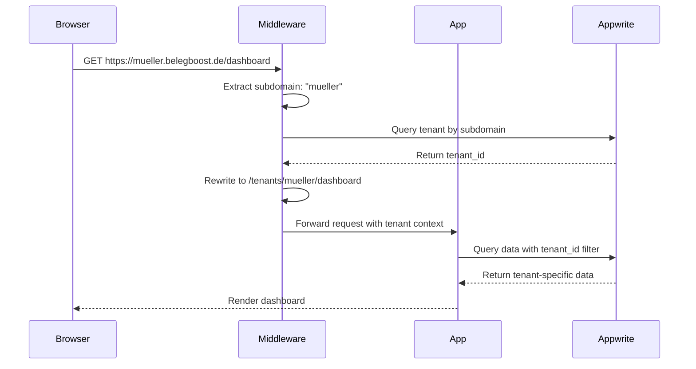
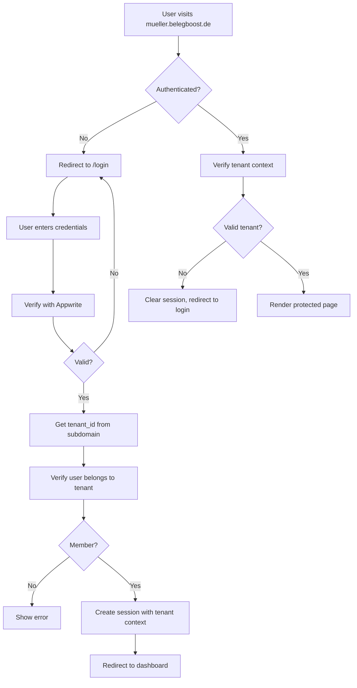
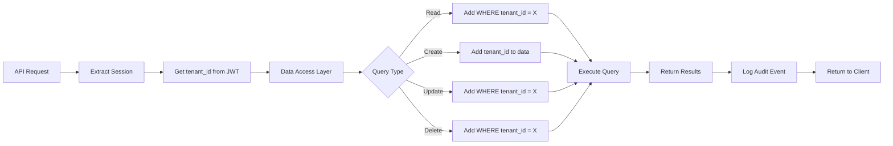

# GitHub Issue Enhancement Recommendations

**Date:** 2025-10-15
**Current Issue:** `github-issue-belegboost.md`
**Purpose:** Specific recommendations to enhance the existing GitHub issue based on 2025 best practices

---

## Executive Summary

Your current GitHub issue for BelegBoost is **exceptionally well-structured** and already follows many best practices. This document provides specific enhancements based on 2025 GitHub features and industry best practices from successful open-source projects.

**Overall Assessment:** 9/10
- Comprehensive implementation plan with clear phases
- Well-defined acceptance criteria
- Risk analysis included
- Technical details thorough

**Areas for Enhancement:**
1. Leverage new GitHub sub-issues feature (GA 2025)
2. Add more visual elements (diagrams, flowcharts)
3. Include specific code snippets for critical patterns
4. Add security review checklist
5. Include references to production examples

---

## Recommended Enhancements

### 1. Use GitHub Sub-Issues (New 2025 Feature)

**Feature:** GitHub now supports parent-child issue hierarchies (GA in early 2025)

**Recommendation:** Create this as the parent issue, then create sub-issues for each phase

**Structure:**
```
Parent Issue: #42 - Build Multi-Tenant Tax Advisor Checklist WebApp (BelegBoost)
├─ Sub-Issue: #43 - Phase 1: Foundation Setup
├─ Sub-Issue: #44 - Phase 2: Authentication & Multi-Tenancy Core
├─ Sub-Issue: #45 - Phase 3: Checklist Management
├─ Sub-Issue: #46 - Phase 4: Document Upload & Storage
├─ Sub-Issue: #47 - Phase 5: Tenant Branding & Customization
├─ Sub-Issue: #48 - Phase 6: GDPR Compliance & Security
└─ Sub-Issue: #49 - Phase 7: Testing, Optimization & Launch
```

**Benefits:**
- Track progress at phase level
- Assign different phases to different team members
- Close sub-issues independently
- Visual progress tracking

**How to Add:**
1. Create parent issue first
2. Create each phase as separate issue
3. Link using "Add sub-issue" button (available in 2025)
4. Reference in parent: `- [ ] #43 Phase 1: Foundation Setup`

**Reference:** https://github.blog/changelog/2025-04-09-evolving-github-issues-and-projects/

---

### 2. Add Visual Architecture Diagrams

**Current State:** Only database schema diagram included

**Recommendation:** Add these diagrams to improve understanding

#### A. Subdomain Routing Flow


#### B. Authentication Flow


#### C. Multi-Tenant Data Flow


**How to Add:** Insert these diagrams into the "Technical Approach" section

---

### 3. Add Critical Code Pattern Snippets

**Recommendation:** Include these essential code patterns directly in the issue

#### A. Middleware Pattern (Critical)
```typescript
// middleware.ts - Add this to Implementation Plan
import { NextRequest, NextResponse } from 'next/server';

export function middleware(request: NextRequest) {
  const url = request.nextUrl;
  const hostname = request.headers.get('host') || '';
  const subdomain = extractSubdomain(hostname);

  // Main domain - no rewrite needed
  if (!subdomain) {
    return NextResponse.next();
  }

  // Validate subdomain exists (optional: query database)
  // For now, just rewrite
  url.pathname = `/tenants/${subdomain}${url.pathname}`;

  // Add tenant context to headers for API routes
  const requestHeaders = new Headers(request.headers);
  requestHeaders.set('x-tenant-subdomain', subdomain);

  return NextResponse.rewrite(url, {
    request: {
      headers: requestHeaders,
    },
  });
}

function extractSubdomain(hostname: string): string | null {
  const host = hostname.split(':')[0];

  // Local development
  if (host.includes('localhost')) {
    const parts = host.split('.');
    return parts.length > 1 && parts[0] !== 'localhost' ? parts[0] : null;
  }

  // Production
  const rootDomain = process.env.NEXT_PUBLIC_ROOT_DOMAIN || 'belegboost.de';
  if (host === rootDomain || host === `www.${rootDomain}`) {
    return null;
  }

  const parts = host.split('.');
  if (parts.length >= 3) {
    return parts.slice(0, parts.length - 2).join('.');
  }

  return null;
}

export const config = {
  matcher: [
    '/((?!_next/static|_next/image|favicon.ico|.*\\.(?:svg|png|jpg|jpeg|gif|webp)$).*)',
  ],
};
```

#### B. Data Access Layer Pattern (Critical for Security)
```typescript
// lib/dal/base.ts - Add to Phase 2 implementation
import { databases } from '@/lib/server/appwrite';
import { Query } from 'node-appwrite';

export class TenantAwareRepository<T> {
  constructor(
    private databaseId: string,
    private collectionId: string,
    private tenantId: string
  ) {
    // CRITICAL: tenantId must be from verified session, never from user input
    if (!tenantId) {
      throw new Error('Tenant ID is required for data access');
    }
  }

  async findAll(additionalQueries: string[] = []): Promise<T[]> {
    const response = await databases.listDocuments(
      this.databaseId,
      this.collectionId,
      [
        Query.equal('tenant_id', this.tenantId),  // ALWAYS first query
        ...additionalQueries,
      ]
    );
    return response.documents as unknown as T[];
  }

  async findById(id: string): Promise<T | null> {
    try {
      const doc = await databases.getDocument(
        this.databaseId,
        this.collectionId,
        id
      );

      // CRITICAL: Verify tenant ownership
      if (doc.tenant_id !== this.tenantId) {
        throw new Error('Access denied: Document belongs to different tenant');
      }

      return doc as unknown as T;
    } catch (error) {
      return null;
    }
  }

  async create(data: Partial<T>): Promise<T> {
    const document = await databases.createDocument(
      this.databaseId,
      this.collectionId,
      'unique()',
      {
        ...data,
        tenant_id: this.tenantId,  // ALWAYS set tenant_id
      }
    );
    return document as unknown as T;
  }

  async update(id: string, data: Partial<T>): Promise<T> {
    // First verify ownership
    const existing = await this.findById(id);
    if (!existing) {
      throw new Error('Document not found or access denied');
    }

    const document = await databases.updateDocument(
      this.databaseId,
      this.collectionId,
      id,
      data
    );
    return document as unknown as T;
  }

  async delete(id: string): Promise<void> {
    // First verify ownership
    const existing = await this.findById(id);
    if (!existing) {
      throw new Error('Document not found or access denied');
    }

    await databases.deleteDocument(
      this.databaseId,
      this.collectionId,
      id
    );
  }
}

// Usage example
export async function getChecklistsForTenant(tenantId: string) {
  const repo = new TenantAwareRepository(
    'belegboost-db',
    'checklists',
    tenantId
  );

  return await repo.findAll([
    Query.orderDesc('created_at'),
    Query.limit(25)
  ]);
}
```

#### C. Audit Logging Pattern (GDPR Requirement)
```typescript
// lib/audit-logger.ts - Add to Phase 6 implementation
import { databases } from '@/lib/server/appwrite';
import { headers } from 'next/headers';

interface AuditLogEntry {
  tenant_id: string;
  user_id: string;
  user_email: string;
  action: string;
  resource_type: string;
  resource_id: string;
  ip_address: string;
  user_agent: string;
  metadata?: Record<string, any>;
  result: 'success' | 'failure';
  error_message?: string;
}

export async function logAuditEvent(event: Omit<AuditLogEntry, 'ip_address' | 'user_agent'>) {
  try {
    const headersList = headers();
    const ip = headersList.get('x-forwarded-for') || headersList.get('x-real-ip') || 'unknown';
    const userAgent = headersList.get('user-agent') || 'unknown';

    await databases.createDocument(
      'belegboost-db',
      'audit_logs',
      'unique()',
      {
        ...event,
        timestamp: new Date().toISOString(),
        ip_address: ip,
        user_agent: userAgent,
      }
    );
  } catch (error) {
    // CRITICAL: Never let audit logging failure break the application
    console.error('Failed to log audit event:', error);
  }
}

// Usage examples
await logAuditEvent({
  tenant_id: session.tenantId,
  user_id: session.userId,
  user_email: session.userEmail,
  action: 'document.upload',
  resource_type: 'document',
  resource_id: documentId,
  result: 'success',
  metadata: {
    filename: file.name,
    size: file.size,
    checklist_id: checklistId,
  },
});

await logAuditEvent({
  tenant_id: session.tenantId,
  user_id: session.userId,
  user_email: session.userEmail,
  action: 'data.export',
  resource_type: 'user',
  resource_id: session.userId,
  result: 'success',
  metadata: {
    export_type: 'gdpr_article_20',
    format: 'json',
  },
});
```

**Where to Add:** Insert these in the relevant phase's "Key Files" section with notation "Reference implementation below"

---

### 4. Add Security Review Checklist Section

**Recommendation:** Add this new section after "Acceptance Criteria"

```markdown
## Security Review Checklist

### Code Review Requirements

#### For ALL Pull Requests
- [ ] No hardcoded credentials or API keys
- [ ] Environment variables used for sensitive config
- [ ] No console.log statements with sensitive data
- [ ] Input validation using Zod schemas
- [ ] Error messages don't leak sensitive information

#### For Database Queries
- [ ] **CRITICAL:** Query includes tenant_id filter
- [ ] Appwrite permissions set correctly
- [ ] Indexes exist on filtered columns
- [ ] No SQL injection vectors (Appwrite handles this)
- [ ] Sensitive data encrypted at rest

#### For API Routes/Server Actions
- [ ] Session verified at start of function
- [ ] Tenant context extracted from verified session (never from user input)
- [ ] Authorization checks before data access
- [ ] Rate limiting implemented (if applicable)
- [ ] Audit logging for sensitive operations

#### For File Uploads
- [ ] MIME type validated
- [ ] File extension whitelisted
- [ ] File size limit enforced
- [ ] Filename sanitized
- [ ] Files stored in tenant-specific bucket
- [ ] Upload logged to audit trail

#### For Authentication
- [ ] Passwords never logged or displayed
- [ ] Session tokens use httpOnly cookies
- [ ] CSRF protection enabled
- [ ] Failed login attempts limited
- [ ] Session expiry configured
- [ ] Logout clears all session data

#### For Frontend Components
- [ ] User input sanitized before rendering
- [ ] XSS prevention (React handles most cases)
- [ ] Sensitive data not stored in localStorage
- [ ] API calls include CSRF tokens
- [ ] Error boundaries catch exceptions

### Penetration Testing Checklist

Before production deployment, verify these attack vectors are mitigated:

- [ ] **Tenant Isolation Bypass:** User from Tenant A cannot access Tenant B data
- [ ] **Authentication Bypass:** Protected routes require valid session
- [ ] **Authorization Bypass:** Users cannot access resources above their role
- [ ] **CSRF Attacks:** State-changing operations require CSRF token
- [ ] **XSS Attacks:** User input properly sanitized
- [ ] **File Upload Exploits:** Malicious files rejected
- [ ] **Session Hijacking:** Session tokens properly secured
- [ ] **SQL Injection:** Parameterized queries used (Appwrite handles this)
- [ ] **Path Traversal:** File paths validated
- [ ] **Subdomain Takeover:** Unused subdomains protected

### GDPR Compliance Review

- [ ] Privacy policy reviewed by legal expert
- [ ] Data Processing Agreement with Appwrite signed
- [ ] Audit logging captures all required events
- [ ] Data export function tested
- [ ] Data deletion function tested (respects retention)
- [ ] Cookie consent properly implemented
- [ ] Impressum contains all required information
- [ ] Data retention policies documented
- [ ] Backup encryption verified
- [ ] Incident response plan documented
```

---

### 5. Reference Production Examples

**Recommendation:** Add this section to "References & Research"

```markdown
### Production Examples & Code References

#### 1. Vercel Platforms Starter Kit (Official Reference)
**Repository:** https://github.com/vercel/platforms
**What to Study:**
- `middleware.ts` - Subdomain detection across environments
- `lib/subdomains.ts` - Subdomain validation and extraction
- `app/app/[domain]/` - Dynamic route structure
- Pattern for handling both subdomains and custom domains

**Key Learnings:**
- Handles localhost, production, and preview deployments
- Uses Redis for tenant data caching
- Implements tenant-specific metadata

**Direct Link to Middleware:** https://github.com/vercel/platforms/blob/main/middleware.ts

#### 2. Multi-Tenant SaaS with Supabase
**Repository:** https://github.com/GGCodeLatam/next-multitenant-2024
**What to Study:**
- Row-level security implementation
- Tenant isolation at database level
- Integration with Cloudflare

**Key Learnings:**
- RLS policies for automatic tenant filtering
- Subdomain routing with Cloudflare
- Environment variable management

#### 3. Appwrite Multi-Tenancy Examples
**Documentation:** https://appwrite.io/docs/products/auth/multi-tenancy
**What to Study:**
- Teams API usage patterns
- Permission configuration examples
- Multi-tenant query patterns

**Key Learnings:**
- Team-based permissions best practices
- Role hierarchy (owner > advisor > client)
- Invitation flow implementation

#### 4. GDPR-Compliant Audit Logging
**Article:** https://www.chino.io/compliance/gdpr-audit-trail-for-health-applications
**What to Study:**
- Immutable log storage patterns
- Required fields for audit logs
- Retention policy examples

**Key Learnings:**
- Pseudonymization techniques
- Balancing GDPR erasure with audit requirements
- Log structure for compliance

#### 5. Next.js Middleware Security
**Article:** https://blog.arcjet.com/next-js-middleware-bypasses-how-to-tell-if-you-were-affected/
**What to Study:**
- CVE-2025-29927 vulnerability details
- Defense-in-depth patterns
- Authorization best practices

**Key Learnings:**
- Never rely solely on middleware for auth
- Always verify in route handlers
- Implement multi-layer security
```

---

### 6. Add Testing Strategy Section

**Recommendation:** Expand Phase 7 with this detailed testing strategy

```markdown
## Detailed Testing Strategy

### Unit Testing (Target: >80% Coverage)

**Framework:** Vitest
**Location:** `__tests__/unit/`

**What to Test:**
```typescript
// lib/utils/subdomain.test.ts
describe('extractSubdomain', () => {
  it('extracts subdomain from production domain', () => {
    expect(extractSubdomain('mueller.belegboost.de')).toBe('mueller');
  });

  it('returns null for root domain', () => {
    expect(extractSubdomain('belegboost.de')).toBe(null);
  });

  it('handles localhost subdomains', () => {
    expect(extractSubdomain('mueller.localhost:3000')).toBe('mueller');
  });

  it('handles multi-level subdomains', () => {
    expect(extractSubdomain('app.mueller.belegboost.de')).toBe('app.mueller');
  });
});

// lib/dal/checklists.test.ts
describe('TenantAwareRepository', () => {
  it('always includes tenant_id in queries', async () => {
    const repo = new TenantAwareRepository('db', 'checklists', 'tenant123');
    const mockQuery = vi.spyOn(databases, 'listDocuments');

    await repo.findAll();

    expect(mockQuery).toHaveBeenCalledWith(
      'db',
      'checklists',
      expect.arrayContaining([
        expect.objectContaining({ attribute: 'tenant_id', value: 'tenant123' })
      ])
    );
  });

  it('throws error when accessing document from different tenant', async () => {
    const repo = new TenantAwareRepository('db', 'checklists', 'tenant123');

    // Mock document from different tenant
    vi.spyOn(databases, 'getDocument').mockResolvedValue({
      $id: 'doc1',
      tenant_id: 'tenant456',  // Different tenant!
    });

    await expect(repo.findById('doc1')).rejects.toThrow('Access denied');
  });
});
```

### Integration Testing

**Framework:** Vitest with MSW (Mock Service Worker)
**Location:** `__tests__/integration/`

**What to Test:**
- Server Actions with mocked Appwrite
- API routes with tenant context
- Authentication flows
- File upload validation

**Example:**
```typescript
// __tests__/integration/auth.test.ts
describe('Authentication Flow', () => {
  it('creates session with tenant context', async () => {
    const result = await loginAction({
      email: 'user@example.com',
      password: 'password123',
      subdomain: 'mueller'
    });

    expect(result.success).toBe(true);
    expect(result.session.tenantId).toBe('mueller-tenant-id');
    expect(result.session.role).toBe('client');
  });

  it('rejects login for wrong tenant', async () => {
    const result = await loginAction({
      email: 'user@tenant-a.com',
      password: 'password123',
      subdomain: 'tenant-b'  // User doesn't belong to this tenant
    });

    expect(result.success).toBe(false);
    expect(result.error).toContain('not authorized');
  });
});
```

### E2E Testing (Critical!)

**Framework:** Playwright
**Location:** `e2e/`

**Priority Tests:**

1. **Tenant Isolation (CRITICAL)**
```typescript
// e2e/tenant-isolation.spec.ts
test('Tenant A cannot access Tenant B dashboard', async ({ page, context }) => {
  // Login as Tenant A user
  await page.goto('https://tenant-a.localhost:3000/login');
  await page.fill('[name=email]', 'user@tenant-a.com');
  await page.fill('[name=password]', 'password');
  await page.click('button[type=submit]');
  await expect(page).toHaveURL(/dashboard/);

  // Try to access Tenant B
  await page.goto('https://tenant-b.localhost:3000/dashboard');

  // Should redirect to login
  await expect(page).toHaveURL(/login/);
});

test('API requests respect tenant isolation', async ({ request }) => {
  // Login to Tenant A
  const loginResponse = await request.post('https://tenant-a.localhost:3000/api/auth/login', {
    data: { email: 'user@tenant-a.com', password: 'password' }
  });
  const cookies = loginResponse.headers()['set-cookie'];

  // Try to query Tenant B data using Tenant A session
  const dataResponse = await request.get('https://tenant-a.localhost:3000/api/checklists', {
    headers: { Cookie: cookies },
    params: { tenant_id: 'tenant-b-id' }  // Malicious parameter
  });

  // Should return empty or forbidden
  expect(dataResponse.status()).toBe(403);
});
```

2. **Full User Journeys**
```typescript
// e2e/advisor-workflow.spec.ts
test('Advisor can create checklist and client can upload document', async ({ browser }) => {
  // Setup: Create two contexts (advisor and client)
  const advisorContext = await browser.newContext();
  const clientContext = await browser.newContext();

  const advisorPage = await advisorContext.newPage();
  const clientPage = await clientContext.newPage();

  // 1. Advisor logs in
  await advisorPage.goto('https://mueller.localhost:3000/login');
  await advisorPage.fill('[name=email]', 'advisor@mueller.com');
  await advisorPage.fill('[name=password]', 'password');
  await advisorPage.click('button[type=submit]');

  // 2. Advisor creates checklist
  await advisorPage.click('text=Neue Checkliste');
  await advisorPage.fill('[name=title]', 'Jahresabschluss 2024');
  await advisorPage.selectOption('[name=client]', 'client-id');
  await advisorPage.click('button:has-text("Erstellen")');
  await expect(advisorPage.locator('text=Jahresabschluss 2024')).toBeVisible();

  // 3. Client logs in
  await clientPage.goto('https://mueller.localhost:3000/login');
  await clientPage.fill('[name=email]', 'client@example.com');
  await clientPage.fill('[name=password]', 'password');
  await clientPage.click('button[type=submit]');

  // 4. Client sees checklist
  await expect(clientPage.locator('text=Jahresabschluss 2024')).toBeVisible();

  // 5. Client uploads document
  await clientPage.click('text=Jahresabschluss 2024');
  const fileInput = clientPage.locator('input[type=file]');
  await fileInput.setInputFiles('fixtures/test-document.pdf');
  await clientPage.click('button:has-text("Hochladen")');
  await expect(clientPage.locator('text=test-document.pdf')).toBeVisible();

  // 6. Advisor sees uploaded document
  await advisorPage.reload();
  await expect(advisorPage.locator('text=test-document.pdf')).toBeVisible();
});
```

3. **GDPR Compliance**
```typescript
// e2e/gdpr.spec.ts
test('User can export their data', async ({ page }) => {
  await loginAsClient(page);

  await page.goto('https://mueller.localhost:3000/einstellungen/daten-export');

  const downloadPromise = page.waitForEvent('download');
  await page.click('button:has-text("Daten exportieren")');
  const download = await downloadPromise;

  expect(download.suggestedFilename()).toMatch(/data-export-.*\.json/);

  // Verify export contains expected data
  const path = await download.path();
  const content = JSON.parse(await fs.readFile(path, 'utf-8'));
  expect(content).toHaveProperty('user');
  expect(content).toHaveProperty('documents');
  expect(content).toHaveProperty('checklists');
});

test('Cookie consent banner appears for new users', async ({ page }) => {
  await page.goto('https://belegboost.de');
  await expect(page.locator('text=Wir verwenden Cookies')).toBeVisible();

  await page.click('button:has-text("Alle akzeptieren")');
  await expect(page.locator('text=Wir verwenden Cookies')).not.toBeVisible();

  // Reload - banner should not appear
  await page.reload();
  await expect(page.locator('text=Wir verwenden Cookies')).not.toBeVisible();
});
```

### Performance Testing

**Framework:** Lighthouse CI
**Configuration:** `lighthouserc.js`

```javascript
module.exports = {
  ci: {
    collect: {
      url: [
        'https://belegboost.de',
        'https://demo.belegboost.de/login',
        'https://demo.belegboost.de/dashboard',
      ],
      numberOfRuns: 3,
    },
    assert: {
      assertions: {
        'categories:performance': ['error', { minScore: 0.9 }],
        'categories:accessibility': ['error', { minScore: 0.9 }],
        'categories:best-practices': ['error', { minScore: 0.9 }],
        'categories:seo': ['error', { minScore: 0.9 }],
      },
    },
    upload: {
      target: 'temporary-public-storage',
    },
  },
};
```

### Security Testing

**Tools:**
- OWASP ZAP for vulnerability scanning
- npm audit for dependency vulnerabilities
- Snyk for continuous monitoring

**Critical Security Tests:**
```bash
# Check for known vulnerabilities
npm audit --production

# Run OWASP ZAP automated scan
docker run -t owasp/zap2docker-stable zap-baseline.py \
  -t https://demo.belegboost.de

# Check for secrets in code
trufflehog git file://. --only-verified
```
```

---

### 7. Add Deployment Checklist

**Recommendation:** Add this as a new top-level section before "Future Considerations"

```markdown
## Production Deployment Checklist

### Pre-Deployment

#### Infrastructure Setup
- [ ] Hetzner VPS provisioned (CPX31: 4 vCPU, 8GB RAM)
- [ ] Domain `belegboost.de` registered and DNS accessible
- [ ] Wildcard DNS configured (`*.belegboost.de → server IP`)
- [ ] SSL certificates obtained (Let's Encrypt wildcard cert)
- [ ] Firewall configured (allow 80, 443, 22; block all others)
- [ ] SSH key-based authentication enabled
- [ ] Non-root user created for deployments

#### Appwrite Setup
- [ ] Appwrite installed via Docker Compose
- [ ] Custom domain configured in Appwrite console
- [ ] Email provider configured (SMTP)
- [ ] Storage configured (local or S3-compatible)
- [ ] Backups scheduled (daily at 2 AM)
- [ ] Monitoring enabled (Prometheus/Grafana)

#### Next.js Configuration
- [ ] Environment variables configured in production
- [ ] Security headers enabled in `next.config.ts`
- [ ] CORS configured properly
- [ ] Rate limiting configured
- [ ] Error tracking set up (Sentry)
- [ ] Analytics configured (privacy-friendly)

### Deployment Steps

1. **Initial Deployment**
```bash
# On server
git clone https://github.com/yourorg/belegboost.git
cd belegboost
npm ci --production
npm run build
pm2 start npm --name "belegboost" -- start
pm2 save
pm2 startup
```

2. **Nginx Configuration**
```nginx
# /etc/nginx/sites-available/belegboost
server {
    listen 443 ssl http2;
    server_name belegboost.de *.belegboost.de;

    ssl_certificate /etc/letsencrypt/live/belegboost.de/fullchain.pem;
    ssl_certificate_key /etc/letsencrypt/live/belegboost.de/privkey.pem;

    location / {
        proxy_pass http://localhost:3000;
        proxy_http_version 1.1;
        proxy_set_header Upgrade $http_upgrade;
        proxy_set_header Connection 'upgrade';
        proxy_set_header Host $host;
        proxy_set_header X-Real-IP $remote_addr;
        proxy_set_header X-Forwarded-For $proxy_add_x_forwarded_for;
        proxy_set_header X-Forwarded-Proto $scheme;
        proxy_cache_bypass $http_upgrade;
    }
}

# Redirect HTTP to HTTPS
server {
    listen 80;
    server_name belegboost.de *.belegboost.de;
    return 301 https://$host$request_uri;
}
```

3. **SSL Certificate Renewal**
```bash
# Test renewal
sudo certbot renew --dry-run

# Add to crontab for auto-renewal
0 0 1 * * certbot renew --quiet && systemctl reload nginx
```

### Post-Deployment Verification

#### Functional Testing
- [ ] Main domain loads correctly (https://belegboost.de)
- [ ] Subdomain routing works (https://demo.belegboost.de)
- [ ] Registration flow completes successfully
- [ ] Email invitations send correctly
- [ ] File uploads work and are stored correctly
- [ ] HTTPS enforced (HTTP redirects to HTTPS)
- [ ] SSL certificate valid and trusted

#### Security Verification
- [ ] Security headers present (run `securityheaders.com` scan)
- [ ] No sensitive data in logs
- [ ] Rate limiting works
- [ ] CSRF protection active
- [ ] Cookie security flags set correctly
- [ ] Content Security Policy configured

#### Performance Verification
- [ ] Lighthouse score > 90 for all metrics
- [ ] Time to First Byte < 600ms
- [ ] First Contentful Paint < 1.8s
- [ ] Largest Contentful Paint < 2.5s
- [ ] No console errors or warnings

#### Compliance Verification
- [ ] Impressum page accessible
- [ ] Datenschutzerklärung accessible
- [ ] Cookie consent banner appears
- [ ] Data export function works
- [ ] Audit logging active
- [ ] All data stored in Germany

### Monitoring Setup

#### Application Monitoring
```javascript
// Install Sentry
npm install @sentry/nextjs

// sentry.client.config.ts
import * as Sentry from '@sentry/nextjs';

Sentry.init({
  dsn: process.env.NEXT_PUBLIC_SENTRY_DSN,
  environment: process.env.NODE_ENV,
  tracesSampleRate: 0.1,
  beforeSend(event) {
    // Don't send sensitive data
    if (event.request) {
      delete event.request.cookies;
      delete event.request.headers?.Authorization;
    }
    return event;
  },
});
```

#### Server Monitoring
- [ ] Uptime monitoring configured (UptimeRobot)
- [ ] Disk space alerts set (< 20% free)
- [ ] Memory usage alerts set (> 80%)
- [ ] CPU usage alerts set (> 80% for 5 min)
- [ ] SSL expiration alerts set (30 days before)
- [ ] Backup success/failure alerts configured

### Rollback Plan

**If deployment fails:**

1. **Quick Rollback**
```bash
pm2 delete belegboost
git checkout previous-stable-tag
npm ci --production
npm run build
pm2 start npm --name "belegboost" -- start
```

2. **Database Rollback** (if schema changed)
```bash
# Restore from latest backup
docker exec appwrite-mariadb mysql -u root -p appwrite < backup-YYYY-MM-DD.sql
```

3. **Notify Users**
- Update status page
- Send email to affected tenants
- Post in admin dashboard

### Post-Launch Monitoring (First 48 Hours)

- [ ] Monitor error rates (should be < 0.1%)
- [ ] Check response times (P95 < 1s)
- [ ] Review user registrations (any failures?)
- [ ] Monitor disk space (uploads working?)
- [ ] Check audit logs for anomalies
- [ ] Review Sentry for unexpected errors
- [ ] Verify backup completion
```

---

## Summary of Recommended Changes

### Critical (Implement First)
1. Add code pattern snippets for middleware, DAL, and audit logging
2. Include security review checklist
3. Add tenant isolation E2E tests
4. Create detailed deployment checklist

### High Value (Implement Second)
1. Use GitHub sub-issues for each phase
2. Add visual diagrams (routing, auth, data flow)
3. Expand testing strategy with specific examples
4. Reference production examples (Vercel Platforms, etc.)

### Nice to Have (Optional)
1. Add performance testing configuration
2. Include monitoring setup examples
3. Document rollback procedures
4. Add troubleshooting section

---

## Implementation Priority

**Week 1:**
- Create parent issue and sub-issues for each phase
- Add critical code patterns to relevant phases
- Include security review checklist

**Week 2:**
- Add visual diagrams
- Expand testing strategy
- Create deployment checklist

**Week 3:**
- Add production examples references
- Document monitoring and rollback
- Final review and polish

---

**Your current issue is excellent!** These enhancements leverage 2025 GitHub features and provide implementation-ready code patterns that will save significant development time. The issue will serve as both a planning document and a reference guide during implementation.
