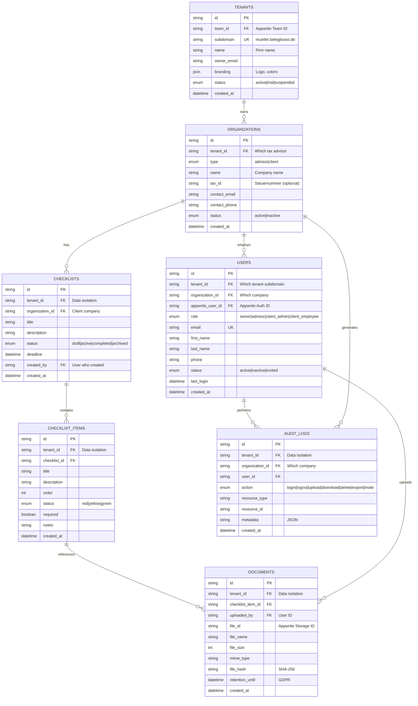

# refactor: Revise Multi-Tenant Architecture for Organization Hierarchies

## Overview

**Critical architectural issue discovered:** The current database schema incorrectly models the tenant → client → users relationship. The existing schema treats "client" as a user role, when in reality **clients are organizations (companies)** with multiple employees who each need their own accounts.

**Impact:** This affects Phase 2 (Authentication) implementation, database schema, RBAC patterns, and invitation flows.

**Status:** Collections created but schema needs complete revision before authentication implementation.

---

## Current Problem

### Existing Schema (Incorrect)

**Source:** `docs/github-issue-belegboost.md` (Lines 92-102)

```
USERS {
    string tenant_id FK
    enum role "owner|advisor|client"  ← PROBLEM: "client" is a role
}

CHECKLISTS {
    string client_id FK  ← PROBLEM: What does this reference?
}
```

### What's Wrong

The current model assumes:
- **Tenant** (tax advisor firm) has **Users** with roles: owner, advisor, client
- **Checklists** have a `client_id` foreign key (but to what?)

**Real-world scenario this fails:**

```
❌ Current (Wrong):
Steuerberater Schmidt
├─ User: Hans Schmidt (role: owner)
├─ User: Maria Müller (role: advisor)
├─ User: Klaus Becker (role: client)  ← Individual client user
└─ User: Anna Koch (role: client)     ← Another individual client user

Problem: Klaus and Anna work for the SAME company (Bäckerei GmbH),
but the schema has no way to group them or assign checklists to their company.
```

**Correct model:**

```
✓ Correct:
Steuerberater Schmidt (Tenant)
├─ Organization: Steuerberater Schmidt GmbH (type: advisor)
│  ├─ User: Hans Schmidt (role: owner)
│  └─ User: Maria Müller (role: advisor)
│
├─ Organization: Bäckerei GmbH (type: client)  ← Client COMPANY
│  ├─ User: Klaus Becker (role: client_admin)
│  └─ User: Anna Koch (role: client_employee)
│  └─ Checklists: [Jahresabschluss 2024, ...]
│
└─ Organization: IT Consulting AG (type: client)  ← Another client COMPANY
   ├─ User: Thomas Klein (role: client_admin)
   └─ Checklists: [Umsatzsteuer Q4, ...]
```

### Evidence from Codebase

**1. Route structure implies CLIENTS are entities:**

`src/app/tenants/[tenant]/(dashboard)/clients/` - This route suggests a "Client Management" page where advisors manage client **companies**, not individual users.

**2. PRD terminology (German):**

- **Mandant** = Client company (business entity)
- **Steuerberater** = Tax advisor firm
- The product is for tax advisors and their **Mandanten** (plural companies)

**3. Phase 2 task (Lines 187-190):**

```markdown
- [ ] Client invitation system
  - [ ] Email invitations to clients
```

**Question:** Invite to what?
- Current model: Invite user as "client" role
- **Correct model:** Invite employee to join their client company

---

## Proposed Solution

### Organization-Based Architecture

**Core Concept:** Introduce an `organizations` collection to represent **both** the tax advisor firm AND client companies as separate entities.

```
┌─────────────────────────────────────────────────────────────┐
│ Tenant (Tax Advisor Firm) - Appwrite Team + Subdomain       │
├─────────────────────────────────────────────────────────────┤
│                                                              │
│ Organization 1: Advisor Firm (type: advisor)                │
│ ├─ User: Owner                                              │
│ └─ User: Advisor 1, Advisor 2, ...                          │
│                                                              │
│ Organization 2: Client Company A (type: client)             │
│ ├─ User: Client Admin                                       │
│ └─ User: Client Employee 1, Client Employee 2, ...          │
│ └─ Checklists assigned to this organization                 │
│                                                              │
│ Organization 3: Client Company B (type: client)             │
│ ├─ User: Client Admin                                       │
│ └─ User: Client Employee 1, Client Employee 2, ...          │
│ └─ Checklists assigned to this organization                 │
│                                                              │
└─────────────────────────────────────────────────────────────┘
```

### Data Relationships



---

## Technical Approach

### Database Schema

#### Collection: `organizations`

**Purpose:** Represents both tax advisor firms AND client companies

```typescript
// src/types/organization.ts

export type OrganizationType = 'advisor' | 'client';
export type OrganizationStatus = 'active' | 'inactive';

export interface Organization {
  $id: string;                          // Appwrite Document ID
  tenant_id: string;                    // FK to tenants (which advisor)
  type: OrganizationType;               // advisor | client
  name: string;                         // Company name (max 200 chars)
  tax_id?: string;                      // German Steuernummer (optional)
  contact_email: string;                // Main contact email
  contact_phone?: string;               // Phone (max 20 chars)
  status: OrganizationStatus;           // active | inactive
  $createdAt: string;                   // Appwrite timestamp
  $updatedAt: string;                   // Appwrite timestamp
}
```

**Appwrite Collection Configuration:**
- Collection ID: `organizations`
- Row Security: **Enabled**
- Indexes:
  - `tenant_id_idx` (key) - Fast filtering by tenant
  - `tenant_type_idx` (key, compound: tenant_id + type) - List advisor vs client orgs

**Columns:**
| Name | Type | Size | Required | Default | Notes |
|------|------|------|----------|---------|-------|
| tenant_id | string | 36 | ✓ | - | FK to tenants |
| type | enum | - | ✓ | - | Values: advisor, client |
| name | string | 200 | ✓ | - | Company name |
| tax_id | string | 50 | ✗ | - | Steuernummer |
| contact_email | email | - | ✓ | - | Main contact |
| contact_phone | string | 20 | ✗ | - | Phone number |
| status | enum | - | ✓ | - | Values: active, inactive |

---

#### Collection: `users` (Updated)

**Purpose:** Links users to organizations (not directly to tenants)

```typescript
// src/types/user.ts

export type UserRole = 'owner' | 'advisor' | 'client_admin' | 'client_employee';
export type UserStatus = 'active' | 'inactive' | 'invited';

export interface User {
  $id: string;                          // Appwrite Document ID
  tenant_id: string;                    // FK (which advisor's subdomain)
  organization_id: string;              // FK to organizations (which company)
  appwrite_user_id: string;             // FK to Appwrite Auth (unique)
  role: UserRole;
  email: string;
  first_name: string;
  last_name: string;
  phone?: string;
  status: UserStatus;
  last_login?: string;
  $createdAt: string;
  $updatedAt: string;
}
```

**Role Definitions:**
- `owner`: Tax advisor firm owner (full access to tenant)
- `advisor`: Tax advisor employee (access to assigned clients)
- `client_admin`: Client company admin (can invite employees, manage their org)
- `client_employee`: Client company employee (view/upload to assigned checklists)

**Appwrite Collection Configuration:**
- Collection ID: `users`
- Row Security: **Enabled**
- Indexes:
  - `tenant_id_idx` (key)
  - `organization_id_idx` (key)
  - `appwrite_user_id_unique` (unique)

**Columns:**
| Name | Type | Size | Required | Default | Notes |
|------|------|------|----------|---------|-------|
| tenant_id | string | 36 | ✓ | - | FK to tenants |
| organization_id | string | 36 | ✓ | - | FK to organizations |
| appwrite_user_id | string | 36 | ✓ | - | Appwrite Auth ID (unique) |
| role | enum | - | ✓ | - | Values: owner, advisor, client_admin, client_employee |
| email | email | - | ✓ | - | User email |
| first_name | string | 100 | ✓ | - | First name |
| last_name | string | 100 | ✓ | - | Last name |
| phone | string | 20 | ✗ | - | Phone number |
| status | enum | - | ✓ | - | Values: active, inactive, invited |
| last_login | datetime | - | ✗ | - | Last login timestamp |

---

#### Collection: `checklists` (Updated)

**Purpose:** Checklists belong to client **organizations**, not individual users

```typescript
// src/types/checklist.ts

export type ChecklistStatus = 'draft' | 'active' | 'completed' | 'archived';

export interface Checklist {
  $id: string;
  tenant_id: string;                    // Tax advisor firm
  organization_id: string;              // FK to organizations (client company)
  title: string;
  description?: string;
  status: ChecklistStatus;
  deadline?: string;
  created_by: string;                   // FK to users (which advisor)
  $createdAt: string;
  $updatedAt: string;
}
```

**Key Change:** `client_id` → `organization_id`

**Appwrite Collection Configuration:**
- Collection ID: `checklists`
- Row Security: **Enabled**
- Indexes:
  - `tenant_id_idx` (key)
  - `organization_id_idx` (key)
  - `tenant_org_idx` (compound: tenant_id + organization_id)

**Columns:**
| Name | Type | Size | Required | Default | Notes |
|------|------|------|----------|---------|-------|
| tenant_id | string | 36 | ✓ | - | Tax advisor firm |
| organization_id | string | 36 | ✓ | - | Client company |
| title | string | 200 | ✓ | - | Checklist title |
| description | string | 1000 | ✗ | - | Description |
| status | enum | - | ✓ | - | Values: draft, active, completed, archived |
| deadline | datetime | - | ✗ | - | Due date |
| created_by | string | 36 | ✓ | - | User who created |

---

#### Collection: `audit_logs` (Updated)

**Purpose:** Track actions with organization context for GDPR compliance

```typescript
// src/types/audit.ts

export type AuditAction =
  | 'login'
  | 'logout'
  | 'upload'
  | 'download'
  | 'delete'
  | 'export'
  | 'invite'
  | 'view';

export interface AuditLog {
  $id: string;
  tenant_id: string;
  organization_id: string;              // NEW: Which organization
  user_id: string;
  action: AuditAction;
  resource_type: string;                // e.g., "checklist", "document"
  resource_id?: string;
  metadata?: string;                    // JSON string
  $createdAt: string;
}
```

**Appwrite Collection Configuration:**
- Collection ID: `audit_logs`
- Row Security: **Enabled**
- Indexes:
  - `tenant_id_idx` (key)
  - `organization_id_idx` (key)
  - `user_id_idx` (key)
  - `created_at_idx` (key, desc)

**Columns:**
| Name | Type | Size | Required | Default | Notes |
|------|------|------|----------|---------|-------|
| tenant_id | string | 36 | ✓ | - | Data isolation |
| organization_id | string | 36 | ✓ | - | Which company |
| user_id | string | 36 | ✓ | - | Who performed action |
| action | enum | - | ✓ | - | Values: login, logout, upload, download, delete, export, invite, view |
| resource_type | string | 50 | ✓ | - | Type of resource |
| resource_id | string | 36 | ✗ | - | Resource ID |
| metadata | string | 2000 | ✗ | - | JSON metadata |

---

### Access Control Logic

#### Advisor Side (owner/advisor roles)

```typescript
// lib/dal/organizations.ts

export async function getClientOrganizations(tenantId: string) {
  // Advisors can see ALL client organizations under their tenant
  return await databases.listDocuments(
    DATABASE_ID,
    ORGANIZATIONS_COLLECTION,
    [
      Query.equal('tenant_id', tenantId),
      Query.equal('type', 'client'),
      Query.orderAsc('name')
    ]
  );
}

export async function getChecklists(tenantId: string, organizationId?: string) {
  const queries = [Query.equal('tenant_id', tenantId)];

  // If organizationId provided, filter by that client
  if (organizationId) {
    queries.push(Query.equal('organization_id', organizationId));
  }

  // Advisors can access ALL checklists under their tenant
  return await databases.listDocuments(
    DATABASE_ID,
    CHECKLISTS_COLLECTION,
    queries
  );
}
```

#### Client Side (client_admin/client_employee roles)

```typescript
// lib/dal/checklists.ts

export async function getMyChecklists(
  tenantId: string,
  organizationId: string
) {
  // Clients can ONLY see checklists for their organization
  return await databases.listDocuments(
    DATABASE_ID,
    CHECKLISTS_COLLECTION,
    [
      Query.equal('tenant_id', tenantId),
      Query.equal('organization_id', organizationId),
      Query.orderDesc('$createdAt')
    ]
  );
}
```

#### Permission Check Helper

```typescript
// lib/rbac.ts

export async function canAccessOrganization(
  userId: string,
  organizationId: string
): Promise<boolean> {
  // Get user's membership
  const userDocs = await databases.listDocuments(
    DATABASE_ID,
    USERS_COLLECTION,
    [Query.equal('appwrite_user_id', userId)]
  );

  if (userDocs.total === 0) return false;

  const user = userDocs.documents[0];

  // Owner/Advisor can access all orgs in their tenant
  if (user.role === 'owner' || user.role === 'advisor') {
    const org = await databases.getDocument(
      DATABASE_ID,
      ORGANIZATIONS_COLLECTION,
      organizationId
    );
    return org.tenant_id === user.tenant_id;
  }

  // Client users can only access their own organization
  return user.organization_id === organizationId;
}
```

---

## Implementation Phases

### Phase 1: Database Cleanup (5 min)

Delete existing collections (they're empty):

```bash
# Via Appwrite MCP
mcp__appwrite-api__tables_db_delete(database_id: "belegboost-db", table_id: "tenants")
mcp__appwrite-api__tables_db_delete(database_id: "belegboost-db", table_id: "users")
mcp__appwrite-api__tables_db_delete(database_id: "belegboost-db", table_id: "checklists")
mcp__appwrite-api__tables_db_delete(database_id: "belegboost-db", table_id: "checklist_items")
mcp__appwrite-api__tables_db_delete(database_id: "belegboost-db", table_id: "documents")
mcp__appwrite-api__tables_db_delete(database_id: "belegboost-db", table_id: "audit_logs")
```

**Note:** Keep the `belegboost-db` database itself.

---

### Phase 2: Create New Collections (30 min)

#### 2.1 Create `organizations` collection

```typescript
// Appwrite MCP calls
mcp__appwrite-api__tables_db_create_table({
  database_id: "belegboost-db",
  table_id: "organizations",
  name: "organizations"
})

// Add columns
mcp__appwrite-api__tables_db_create_string_column({
  database_id: "belegboost-db",
  table_id: "organizations",
  key: "tenant_id",
  size: 36,
  required: true
})

mcp__appwrite-api__tables_db_create_enum_column({
  database_id: "belegboost-db",
  table_id: "organizations",
  key: "type",
  elements: ["advisor", "client"],
  required: true
})

mcp__appwrite-api__tables_db_create_string_column({
  database_id: "belegboost-db",
  table_id: "organizations",
  key: "name",
  size: 200,
  required: true
})

mcp__appwrite-api__tables_db_create_string_column({
  database_id: "belegboost-db",
  table_id: "organizations",
  key: "tax_id",
  size: 50,
  required: false
})

mcp__appwrite-api__tables_db_create_email_column({
  database_id: "belegboost-db",
  table_id: "organizations",
  key: "contact_email",
  required: true
})

mcp__appwrite-api__tables_db_create_string_column({
  database_id: "belegboost-db",
  table_id: "organizations",
  key: "contact_phone",
  size: 20,
  required: false
})

mcp__appwrite-api__tables_db_create_enum_column({
  database_id: "belegboost-db",
  table_id: "organizations",
  key: "status",
  elements: ["active", "inactive"],
  required: true
})

// Create indexes
mcp__appwrite-api__tables_db_create_index({
  database_id: "belegboost-db",
  table_id: "organizations",
  key: "tenant_id_idx",
  type: "key",
  columns: ["tenant_id"]
})

mcp__appwrite-api__tables_db_create_index({
  database_id: "belegboost-db",
  table_id: "organizations",
  key: "tenant_type_idx",
  type: "key",
  columns: ["tenant_id", "type"]
})
```

#### 2.2 Recreate `tenants` collection

(Keep existing structure from Phase 1 - no changes needed)

#### 2.3 Recreate `users` collection with `organization_id`

```typescript
// Create table
mcp__appwrite-api__tables_db_create_table({
  database_id: "belegboost-db",
  table_id: "users",
  name: "users"
})

// Add columns (updated with organization_id and new roles)
mcp__appwrite-api__tables_db_create_string_column({
  database_id: "belegboost-db",
  table_id: "users",
  key: "tenant_id",
  size: 36,
  required: true
})

mcp__appwrite-api__tables_db_create_string_column({
  database_id: "belegboost-db",
  table_id: "users",
  key: "organization_id",
  size: 36,
  required: true
})

mcp__appwrite-api__tables_db_create_string_column({
  database_id: "belegboost-db",
  table_id: "users",
  key: "appwrite_user_id",
  size: 36,
  required: true
})

mcp__appwrite-api__tables_db_create_enum_column({
  database_id: "belegboost-db",
  table_id: "users",
  key: "role",
  elements: ["owner", "advisor", "client_admin", "client_employee"],
  required: true
})

// ... (rest of columns: email, first_name, last_name, phone, status, last_login)

// Create indexes
mcp__appwrite-api__tables_db_create_index({
  database_id: "belegboost-db",
  table_id: "users",
  key: "tenant_id_idx",
  type: "key",
  columns: ["tenant_id"]
})

mcp__appwrite-api__tables_db_create_index({
  database_id: "belegboost-db",
  table_id: "users",
  key: "organization_id_idx",
  type: "key",
  columns: ["organization_id"]
})

mcp__appwrite-api__tables_db_create_index({
  database_id: "belegboost-db",
  table_id: "users",
  key: "appwrite_user_id_unique",
  type: "unique",
  columns: ["appwrite_user_id"]
})
```

#### 2.4 Recreate `checklists` with `organization_id`

```typescript
// Similar pattern - add organization_id column instead of client_id
mcp__appwrite-api__tables_db_create_string_column({
  database_id: "belegboost-db",
  table_id: "checklists",
  key: "organization_id",
  size: 36,
  required: true
})

mcp__appwrite-api__tables_db_create_index({
  database_id: "belegboost-db",
  table_id: "checklists",
  key: "organization_id_idx",
  type: "key",
  columns: ["organization_id"]
})
```

#### 2.5 Recreate `checklist_items` (no changes)

Same as before - no schema changes needed.

#### 2.6 Recreate `documents` (no changes)

Same as before - no schema changes needed.

#### 2.7 Recreate `audit_logs` with `organization_id`

```typescript
// Add organization_id column
mcp__appwrite-api__tables_db_create_string_column({
  database_id: "belegboost-db",
  table_id: "audit_logs",
  key: "organization_id",
  size: 36,
  required: true
})

mcp__appwrite-api__tables_db_create_index({
  database_id: "belegboost-db",
  table_id: "audit_logs",
  key: "organization_id_idx",
  type: "key",
  columns: ["organization_id"]
})
```

---

### Phase 3: Update Code (15 min)

#### 3.1 Create `src/types/organization.ts`

```typescript
export type OrganizationType = 'advisor' | 'client';
export type OrganizationStatus = 'active' | 'inactive';

export interface Organization {
  $id: string;
  tenant_id: string;
  type: OrganizationType;
  name: string;
  tax_id?: string;
  contact_email: string;
  contact_phone?: string;
  status: OrganizationStatus;
  $createdAt: string;
  $updatedAt: string;
}
```

#### 3.2 Update `src/types/user.ts`

```typescript
// Change role type
export type UserRole = 'owner' | 'advisor' | 'client_admin' | 'client_employee';

// Add organization_id field
export interface User {
  $id: string;
  tenant_id: string;
  organization_id: string;  // NEW
  appwrite_user_id: string;
  role: UserRole;           // UPDATED
  email: string;
  first_name: string;
  last_name: string;
  phone?: string;
  status: UserStatus;
  last_login?: string;
  $createdAt: string;
  $updatedAt: string;
}
```

#### 3.3 Update `src/types/checklist.ts`

```typescript
export interface Checklist {
  $id: string;
  tenant_id: string;
  organization_id: string;  // CHANGED from client_id
  title: string;
  description?: string;
  status: ChecklistStatus;
  deadline?: string;
  created_by: string;       // NEW
  $createdAt: string;
  $updatedAt: string;
}
```

#### 3.4 Update `.env.local`

```bash
# Update collection IDs (will change after recreation)
APPWRITE_ORGANIZATIONS_COLLECTION=organizations
# ... update all collection IDs with new values
```

---

## Alternative Approaches Considered

### Option 1: Keep "client" as a role, add "company" field to users

**Pattern:** Add `company_name` string field to users table

**Pros:**
- Minimal schema changes
- Simpler to implement

**Cons:**
- Cannot enforce data integrity (typos in company names)
- No way to manage company-level settings
- Cannot invite users to a company before they exist
- No central place to store client company metadata (tax ID, contact info)
- Difficult to implement "all employees of Company X" queries

**Decision:** ❌ Rejected - Not scalable, poor data modeling

---

### Option 2: Use Appwrite Teams for nested organizations

**Pattern:** Create an Appwrite Team for each client company

**Pros:**
- Native team permissions
- Built-in invitation system

**Cons:**
- **Appwrite does not support nested teams** (confirmed in research)
- Cannot model "tenant → client org" hierarchy in Teams API
- Would need one team per client company = hundreds of teams
- No parent-child team relationships

**Decision:** ❌ Rejected - Appwrite Teams don't support hierarchy

**Source:** Appwrite Docs - https://appwrite.io/docs/products/auth/teams

---

### Option 3: Separate database per tenant

**Pattern:** Create a new Appwrite database for each tax advisor firm

**Pros:**
- Strongest data isolation
- Simpler queries (no tenant_id filtering needed)

**Cons:**
- High operational complexity
- Cannot query across tenants (analytics, reporting)
- Appwrite database limits
- Difficult to migrate schema changes across 100+ databases

**Decision:** ❌ Rejected - Overkill for SMB market

**Source:** https://www.bytebase.com/blog/multi-tenant-database-architecture-patterns-explained/

---

## Acceptance Criteria

### Functional Requirements

#### Multi-Organization Support
- [ ] Tax advisor firms can create client organizations
- [ ] Client organizations have metadata (name, tax ID, contact info)
- [ ] Users belong to exactly one organization
- [ ] Organizations are typed (advisor vs client)
- [ ] Checklists are assigned to client organizations (not individual users)
- [ ] All employees of a client organization can access that organization's checklists

#### Role-Based Access Control
- [ ] **Owner role:** Full access to tenant, can manage advisors and clients
- [ ] **Advisor role:** Can access all client organizations within tenant
- [ ] **Client Admin role:** Can invite client employees, manage their organization
- [ ] **Client Employee role:** Can view/upload to checklists assigned to their organization

#### Invitation Flows
- [ ] Advisor can invite client organization admin
- [ ] Client admin can invite client employees to their organization
- [ ] Owner can invite advisors to the advisor firm
- [ ] All invitations create pending user records with status="invited"

#### Data Isolation
- [ ] All queries filter by `tenant_id` for data isolation
- [ ] Advisors cannot access other tenants' data
- [ ] Client employees cannot access other client organizations' data
- [ ] Database indexes exist on `tenant_id` for all collections

### Non-Functional Requirements

#### Database Schema
- [ ] `organizations` collection exists with correct columns and indexes
- [ ] `users` collection has `organization_id` foreign key
- [ ] `checklists` collection has `organization_id` (not `client_id`)
- [ ] `audit_logs` collection tracks `organization_id`
- [ ] All collections have `tenant_id` indexed
- [ ] Unique index on `users.appwrite_user_id`

#### Type Safety
- [ ] TypeScript types match database schema exactly
- [ ] `UserRole` type includes all 4 roles
- [ ] `Organization` interface exists
- [ ] All types use Appwrite conventions (`$id`, `$createdAt`, etc.)

#### Code Quality
- [ ] Data Access Layer enforces tenant filtering on all queries
- [ ] No direct database queries in components (use DAL)
- [ ] Permission checks use `canAccessOrganization()` helper
- [ ] All Server Actions validate tenant context

### Quality Gates

#### Testing
- [ ] Write tests to verify advisor cannot access other tenant's organizations
- [ ] Write tests to verify client employee cannot access other organizations
- [ ] Test that organization-level permissions work correctly
- [ ] Test invitation flows for all user roles

#### Documentation
- [ ] Update main GitHub issue with corrected ERD diagram
- [ ] Update CLAUDE.md with organization patterns
- [ ] Document all 4 user roles and their permissions
- [ ] Add examples to Data Access Layer patterns

---

## Success Metrics

### Data Integrity
- **Target:** 100% of database queries include `tenant_id` filtering
- **Validation:** Code review checklist + DAL pattern enforcement

### Access Control
- **Target:** 0 cross-tenant data leaks in testing
- **Validation:** Integration tests with multiple tenants

### Developer Experience
- **Target:** TypeScript types match database schema 100%
- **Validation:** No TypeScript errors, strict mode enabled

### Performance
- **Target:** All organization queries use indexes (< 100ms)
- **Validation:** Appwrite query performance monitoring

---

## Dependencies & Prerequisites

### Technical Dependencies
- Appwrite Cloud instance with existing database
- Appwrite MCP configured with API key
- Collections are currently empty (safe to delete/recreate)

### Blockers
- [ ] None - collections are empty, safe to proceed

### Risks
- **Low Risk:** Schema change is straightforward (no data migration)
- **Medium Risk:** Must update all Type definitions to match
- **Low Risk:** Existing middleware works (no changes needed)

---

## Migration Impact

### Code Changes Required

**Files to Create:**
- `src/types/organization.ts` - New organization types

**Files to Update:**
- `src/types/user.ts` - Add `organization_id`, update `UserRole`
- `src/types/checklist.ts` - Change `client_id` to `organization_id`
- `src/types/audit.ts` - Add `organization_id`
- `.env.local` - Update collection IDs

**Files to Delete:**
- None

### Database Changes

**Collections to Delete:** 6 (all existing collections)
**Collections to Create:** 7 (6 recreated + 1 new `organizations`)
**Data Loss:** None (collections are empty)

---

## References & Research

### Internal References
- Current schema: `docs/github-issue-belegboost.md` (Lines 72-139)
- Phase 2 plan: `docs/github-issue-belegboost.md` (Lines 171-209)
- User types: `src/types/user.ts` (Lines 1-44)
- Middleware: `src/middleware.ts` (Lines 16-55)
- Tenant context: `src/lib/server/tenant.ts` (Lines 30-69)
- Project conventions: `CLAUDE.md` (Lines 28-48)

### External References

**Appwrite Multi-Tenancy:**
- Teams API: https://appwrite.io/docs/products/auth/teams
- Multi-Tenancy Guide: https://appwrite.io/docs/products/auth/multi-tenancy
- Permissions: https://appwrite.io/docs/advanced/platform/permissions
- Database Queries: https://appwrite.io/docs/products/databases/queries

**Multi-Tenant Architecture Patterns:**
- Microsoft Azure: https://learn.microsoft.com/en-us/azure/azure-sql/database/saas-tenancy-app-design-patterns
- AWS Multi-Tenant: https://aws.amazon.com/blogs/database/multi-tenant-data-isolation-with-postgresql-row-level-security/
- Clerk Multi-Tenancy: https://clerk.com/docs/guides/multi-tenant-architecture
- Auth0 Organizations: https://auth0.com/blog/role-management-auth0-organizations-b2b-saas/

**Database Schema Best Practices:**
- Bytebase Multi-Tenant Patterns: https://www.bytebase.com/blog/multi-tenant-database-architecture-patterns-explained/
- Hierarchical Data Modeling: https://rspacesamuel.medium.com/data-modeling-for-hierarchical-relationships-708d2db295e9

### Related Work
- Phase 1 PR: f9da9c7 "Phase 1: Foundation - Multi-Tenant Architecture"
- Current branch: `feature/phase-2-authentication`

---

## Next Steps

1. **Review & Approve** this architecture revision
2. **Delete existing collections** via Appwrite MCP
3. **Create new collections** with organization schema
4. **Update TypeScript types** to match new schema
5. **Update `.env.local`** with new collection IDs
6. **Create Data Access Layer** with organization support
7. **Implement invitation flows** for organizations
8. **Test multi-organization access control**
9. **Update main GitHub issue** with corrected ERD
10. **Proceed with Phase 2** authentication implementation

---

**Ready for Implementation:** This architecture correctly models the real-world relationship between tax advisor firms, client companies, and their respective employees. All database schema changes are documented with complete TypeScript types and Appwrite MCP commands.
