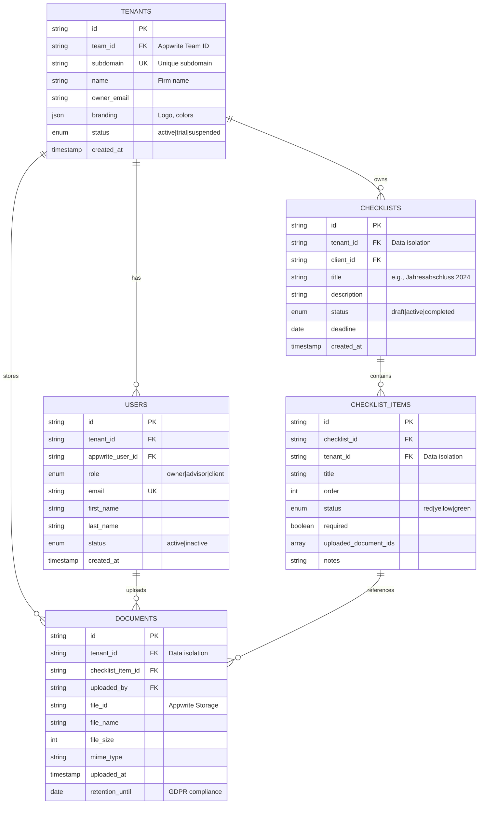

# feat: Build Multi-Tenant Tax Advisor Checklist WebApp (BelegBoost)

## Overview

BelegBoost is a multi-tenant B2B SaaS application designed for German tax advisors (Steuerberater) and their clients (Mandanten). The platform enables checklist management with document uploads and status tracking via a traffic light system. Each tax advisor operates their own branded subdomain ([berater-domain].belegboost.de) where both the advisor and their clients can log in to manage checklists and financial documents.

**Target Market:** German tax advisory firms (DACH region)
**Compliance:** GDPR, BDSG, BSI IT-Grundschutz (German financial data regulations)

## Problem Statement

Tax advisors currently lack a centralized, secure platform to:
- Manage document collection from clients
- Track checklist completion status with visual indicators
- Provide clients with self-service document upload
- Maintain strict data isolation between different advisory firms
- Ensure GDPR compliance for sensitive financial data

Each advisory firm needs their own branded portal without the complexity of managing separate deployments. The subdomain-based multi-tenancy approach provides tenant isolation while maintaining a single codebase and deployment.

## Proposed Solution

Build a greenfield Next.js 15 application with subdomain-based multi-tenancy using:
- **Frontend:** Next.js 15, TypeScript, Tailwind CSS, shadcn/ui
- **Backend:** Appwrite (Auth, Database, Storage)
- **Architecture:** Single deployment serving all tenants via middleware-based routing
- **Deployment:** Self-hosted on Hetzner Germany (GDPR compliance)

### Domain Structure
```
belegboost.de                           → Main landing + registration
[berater-subdomain].belegboost.de      → Tax advisor portal with branding
```

## Technical Approach

### Architecture

#### Multi-Tenancy Model
- **Subdomain-based tenant isolation**
- Next.js 15 middleware detects subdomain and rewrites routes
- Single Next.js deployment serves all tenants dynamically
- Appwrite Teams API provides backend tenant isolation

#### Routing Strategy

```
Next.js App Router Structure:
├── app/
│   ├── (main)/                      # belegboost.de
│   │   ├── page.tsx                 # Landing/registration
│   │   ├── pricing/
│   │   └── impressum/               # Legal (required in Germany)
│   │
│   ├── tenants/
│   │   └── [tenant]/                # [berater].belegboost.de
│   │       ├── (auth)/
│   │       │   └── login/
│   │       ├── (dashboard)/
│   │       │   ├── page.tsx         # Dashboard
│   │       │   ├── checklists/      # Checklist management
│   │       │   ├── documents/       # Document library
│   │       │   ├── clients/         # Client management (advisor only)
│   │       │   └── einstellungen/   # Settings
│   │       └── layout.tsx           # Tenant branding wrapper
│   │
│   └── middleware.ts                # Subdomain detection
```

#### Database Schema (Appwrite)



### Implementation Phases

#### Phase 1: Foundation (Weeks 1-3)

**Tasks:**
- [ ] Initialize Next.js 15 project with TypeScript, Tailwind, shadcn/ui
- [ ] Set up Git repository with proper `.gitignore` and branch strategy
- [ ] Configure Appwrite (self-hosted on Hetzner Germany)
- [ ] Implement middleware for subdomain detection and routing
- [ ] Create base folder structure (`app/(main)`, `app/tenants/[tenant]`)
- [ ] Set up environment variables (`.env.local`, `.env.example`)
- [ ] Configure TypeScript strict mode
- [ ] Install core dependencies (Appwrite SDK, shadcn/ui, Zod, react-hook-form)

**Success Criteria:**
- `npm run dev` starts local development server
- Middleware correctly detects subdomains (test with `hosts` file)
- Appwrite connection successful
- shadcn/ui components render correctly

**Estimated Effort:** 2-3 weeks

**Key Files to Create:**
- `middleware.ts` - Subdomain routing logic
- `lib/server/appwrite.ts` - Server SDK initialization
- `lib/tenant-context.tsx` - Client-side context
- `next.config.ts` - Security headers, image domains
- `tailwind.config.ts` - Custom theme configuration
- `types/tenant.ts`, `types/user.ts` - TypeScript definitions

#### Phase 2: Authentication & Multi-Tenancy Core (Weeks 4-6)

**Tasks:**
- [ ] Implement Appwrite Teams API integration
- [ ] Create tax advisor registration flow (main domain)
  - [ ] Company details form with validation
  - [ ] Subdomain availability check
  - [ ] Create Appwrite Team + owner user
  - [ ] Send verification email
- [ ] Create login flow (subdomains)
  - [ ] Email/password authentication
  - [ ] Session management with cookies
  - [ ] Tenant context resolution from subdomain
- [ ] Implement role-based access control (RBAC)
  - [ ] Roles: `owner`, `advisor`, `client`
  - [ ] Permission checks using Appwrite Teams
- [ ] Client invitation system
  - [ ] Generate invitation links
  - [ ] Email invitations to clients
  - [ ] Accept invitation flow
- [ ] Protected routes with auth middleware
- [ ] Logout functionality

**Success Criteria:**
- Tax advisors can register and create subdomain
- Users can log in via subdomain
- Role-based UI rendering works
- Clients can accept invitations and access portal
- Sessions persist correctly across page navigations
- Unauthorized users redirected to login

**Estimated Effort:** 2-3 weeks

**Key Files:**
- `app/(main)/register/page.tsx`
- `app/tenants/[tenant]/(auth)/login/page.tsx`
- `actions/auth.ts` - Server Actions for auth
- `lib/server/tenant.ts` - Tenant resolution
- `lib/dal/auth.ts` - Data Access Layer for auth checks

#### Phase 3: Checklist Management (Weeks 7-9)

**Tasks:**
- [ ] Design and create Appwrite database collections
  - [ ] `tenants` collection with indexes
  - [ ] `checklists` collection with team permissions
  - [ ] `checklist_items` collection with tenant isolation
- [ ] Build checklist CRUD operations
  - [ ] Create new checklist (advisor only)
  - [ ] List checklists (role-based filtering)
  - [ ] Update checklist details
  - [ ] Delete checklist (advisor only)
  - [ ] Archive completed checklists
- [ ] Implement checklist items
  - [ ] Add/remove items from checklist
  - [ ] Reorder items (drag-and-drop)
  - [ ] Update item status (red/yellow/green)
  - [ ] Add notes to items
- [ ] Build traffic light status system
  - [ ] Custom Badge variants (success/warning/error)
  - [ ] Visual indicators on checklist cards
  - [ ] Automatic status calculation (all items complete = green)
- [ ] Create UI components
  - [ ] ChecklistCard component
  - [ ] ChecklistItemRow component
  - [ ] TrafficLightBadge component
  - [ ] ChecklistForm with validation

**Success Criteria:**
- Advisors can create checklists for clients
- Clients can view assigned checklists
- Status updates reflect immediately in UI
- Checklist items sortable via drag-and-drop
- Traffic light colors update automatically based on completion

**Estimated Effort:** 2-3 weeks

**Key Files:**
- `app/tenants/[tenant]/(dashboard)/checklists/page.tsx`
- `app/tenants/[tenant]/(dashboard)/checklists/[id]/page.tsx`
- `components/checklist/checklist-card.tsx`
- `components/checklist/checklist-item.tsx`
- `components/ui/badge.tsx` (customized)
- `actions/checklists.ts`
- `lib/dal/checklists.ts`
- `lib/validations/checklist.ts` (Zod schemas)

#### Phase 4: Document Upload & Storage (Weeks 10-12)

**Tasks:**
- [ ] Configure Appwrite Storage buckets
  - [ ] Create bucket per tenant on registration
  - [ ] Set file type restrictions (PDF, JPG, PNG, XLSX, DOCX)
  - [ ] Configure max file size (10MB)
  - [ ] Enable encryption (AES)
- [ ] Implement file upload component
  - [ ] Use react-dropzone for drag-and-drop
  - [ ] File validation (type, size, extension)
  - [ ] Upload progress indicator
  - [ ] Multiple file support
- [ ] Build document management
  - [ ] Upload documents to checklist items
  - [ ] List documents with thumbnails
  - [ ] Download documents
  - [ ] Delete documents (with confirmation)
  - [ ] Document preview (PDF viewer)
- [ ] Implement security measures
  - [ ] Validate file MIME types
  - [ ] Sanitize file names
  - [ ] Tenant-scoped storage access
  - [ ] Audit logging for uploads/downloads
- [ ] Link documents to checklist items
  - [ ] Attach multiple documents per item
  - [ ] Display document count on items
  - [ ] Update item status when documents uploaded

**Success Criteria:**
- Users can upload files via drag-and-drop
- File validation prevents unsupported types
- Documents stored in tenant-specific buckets
- Only authorized users can access documents
- Document downloads work correctly
- PDF preview renders in browser

**Estimated Effort:** 2-3 weeks

**Key Files:**
- `components/documents/file-upload.tsx`
- `components/documents/document-list.tsx`
- `components/documents/document-preview.tsx`
- `app/tenants/[tenant]/(dashboard)/documents/page.tsx`
- `actions/documents.ts`
- `lib/dal/documents.ts`
- `lib/server/storage.ts`
- `lib/validations/file.ts`

#### Phase 5: Tenant Branding & Customization (Weeks 13-14)

**Tasks:**
- [ ] Design tenant settings UI
  - [ ] Color picker for primary/secondary colors
  - [ ] Logo upload (PNG/SVG, max 2MB)
  - [ ] Company details form
- [ ] Implement dynamic theming
  - [ ] CSS custom properties for colors
  - [ ] Apply tenant colors via inline styles
  - [ ] Dark mode support (optional)
- [ ] Build branding system
  - [ ] Fetch tenant settings on subdomain load
  - [ ] Apply branding in tenant layout
  - [ ] Display tenant logo in header
  - [ ] Preview branding changes before saving
- [ ] Create tenant settings page (advisor only)
  - [ ] Update company details
  - [ ] Customize branding
  - [ ] Manage subscription
  - [ ] View usage statistics

**Success Criteria:**
- Each subdomain displays unique branding
- Logo appears in header/footer
- Primary color applies to buttons, links
- Changes save and persist across sessions
- Preview mode works before saving

**Estimated Effort:** 1-2 weeks

**Key Files:**
- `app/tenants/[tenant]/(dashboard)/einstellungen/page.tsx`
- `components/tenant/tenant-branding.tsx`
- `components/tenant/color-picker.tsx`
- `components/tenant/logo-upload.tsx`
- `lib/tenant-theme.ts`
- `actions/tenant-settings.ts`

#### Phase 6: GDPR Compliance & Security (Weeks 15-16)

**Tasks:**
- [ ] Implement GDPR-required pages
  - [ ] Impressum (imprint) with company details
  - [ ] Datenschutzerklärung (privacy policy)
  - [ ] Cookie consent banner (German law compliant)
- [ ] Build data export feature
  - [ ] Export user data as JSON
  - [ ] Export documents as ZIP archive
  - [ ] GDPR Article 20 compliance
- [ ] Implement data deletion
  - [ ] Account deletion flow
  - [ ] Hard delete vs soft delete strategy
  - [ ] Document retention policies (10 years for tax docs)
  - [ ] GDPR Article 17 compliance
- [ ] Add audit logging
  - [ ] Log all document uploads/downloads
  - [ ] Log user logins
  - [ ] Log data exports/deletions
  - [ ] Searchable audit log (advisor only)
- [ ] Security hardening
  - [ ] Rate limiting on auth endpoints
  - [ ] CSRF protection
  - [ ] XSS prevention (sanitize inputs)
  - [ ] SQL injection prevention (Appwrite handles)
  - [ ] Content Security Policy headers
- [ ] Create security documentation
  - [ ] Data processing documentation (Verarbeitungsverzeichnis)
  - [ ] Security incident response plan
  - [ ] Data breach notification process (72 hours)

**Success Criteria:**
- Impressum and Datenschutz pages accessible from all pages
- Cookie consent banner appears on first visit
- Users can export their data
- Account deletion removes all personal data (respects retention)
- Audit log captures all sensitive operations
- Security headers configured correctly
- GDPR compliance checklist 100% complete

**Estimated Effort:** 1-2 weeks

**Key Files:**
- `app/(main)/impressum/page.tsx`
- `app/(main)/datenschutz/page.tsx`
- `components/gdpr/cookie-consent.tsx`
- `app/tenants/[tenant]/(dashboard)/einstellungen/daten-export/page.tsx`
- `actions/gdpr.ts`
- `lib/audit-logger.ts`
- `docs/GDPR_COMPLIANCE.md`

#### Phase 7: Testing, Optimization & Launch (Weeks 17-18)

**Tasks:**
- [ ] Write unit tests
  - [ ] Test utility functions
  - [ ] Test validation schemas
  - [ ] Test React components (React Testing Library)
- [ ] Write integration tests
  - [ ] Test API routes
  - [ ] Test Server Actions
  - [ ] Test auth flows
- [ ] Write E2E tests (Playwright)
  - [ ] Tax advisor registration flow
  - [ ] Client invitation and login
  - [ ] Checklist creation and management
  - [ ] Document upload flow
  - [ ] Multi-tenant isolation tests (critical!)
- [ ] Performance optimization
  - [ ] Implement caching strategy (Redis/Upstash)
  - [ ] Optimize database queries (indexes)
  - [ ] Image optimization (Next.js Image)
  - [ ] Code splitting
  - [ ] Lighthouse score > 90
- [ ] Deploy to production
  - [ ] Set up Hetzner server (Germany)
  - [ ] Configure Docker Compose
  - [ ] Set up SSL certificates (Let's Encrypt)
  - [ ] Configure DNS (wildcard subdomain)
  - [ ] Set up monitoring (Sentry/LogRocket)
  - [ ] Configure backups (daily)
- [ ] Create documentation
  - [ ] README.md with setup instructions
  - [ ] ARCHITECTURE.md with technical decisions
  - [ ] DEPLOYMENT.md with deployment guide
  - [ ] User documentation (German)

**Success Criteria:**
- Test coverage > 80%
- All E2E tests pass
- Lighthouse performance score > 90
- No critical security vulnerabilities
- Application deployed to production
- Wildcard subdomain routing works
- SSL certificates active
- Documentation complete

**Estimated Effort:** 1-2 weeks

**Key Files:**
- `__tests__/` directory structure
- `playwright.config.ts`
- `docker-compose.yml`
- `docs/DEPLOYMENT.md`
- `docs/USER_GUIDE.md`

## Alternative Approaches Considered

### 1. Single Domain with Path-Based Routing

**Pattern:** `/tenant/[subdomain]/...`

**Pros:**
- Simpler DNS configuration
- No wildcard SSL needed
- Easier local development

**Cons:**
- Less professional appearance
- Harder to implement per-tenant branding
- Can't use custom domains easily later
- Poor SEO (shared domain)

**Decision:** ❌ Rejected - Subdomain approach provides better tenant isolation and branding

### 2. Separate Database per Tenant

**Pattern:** Create new Appwrite database for each tenant

**Pros:**
- Strongest data isolation
- Easier to scale individual tenants
- Simpler to backup single tenant

**Cons:**
- Complex to manage at scale
- Can't query across tenants (analytics)
- Higher infrastructure costs
- Appwrite limits on database count

**Decision:** ❌ Rejected - Appwrite Teams provides sufficient isolation with better manageability

### 3. Serverless Functions Instead of Appwrite

**Pattern:** Use Vercel Edge Functions + PlanetScale/Supabase

**Pros:**
- More granular control
- Can optimize specific queries
- Popular in Next.js ecosystem

**Cons:**
- More code to write and maintain
- Need to implement auth from scratch
- Storage requires separate service (S3)
- Complexity increases significantly

**Decision:** ❌ Rejected - Appwrite provides integrated solution (auth + database + storage) reducing complexity

### 4. Vercel Deployment vs Self-Hosted

**Vercel Pros:**
- Zero DevOps overhead
- Automatic scaling
- Edge network (fast globally)
- Native Next.js support

**Self-Hosted Pros:**
- Full GDPR compliance (German server)
- Lower costs at scale
- Complete control
- No vendor lock-in

**Decision:** ✅ Self-hosted on Hetzner Germany - GDPR compliance is critical for financial data

## Acceptance Criteria

### Functional Requirements

#### Multi-Tenancy
- [ ] Main domain (`belegboost.de`) displays landing page and registration
- [ ] Subdomains (`[berater].belegboost.de`) route to tenant-specific portals
- [ ] Each tenant has isolated data (no cross-tenant data leakage)
- [ ] Subdomain availability checked during registration
- [ ] Tenant branding (logo, colors) applies to entire subdomain

#### Authentication & Authorization
- [ ] Tax advisors can register and create account
- [ ] Users can log in via email/password on subdomain
- [ ] Role-based access control (owner, advisor, client)
- [ ] Advisors can invite clients via email
- [ ] Clients can accept invitations and create accounts
- [ ] Sessions persist across page reloads
- [ ] Users can log out
- [ ] Protected routes redirect to login

#### Checklist Management
- [ ] Advisors can create checklists with title, description, deadline
- [ ] Advisors can add multiple items to checklists
- [ ] Items have title, description, status (red/yellow/green)
- [ ] Items can be reordered
- [ ] Clients can view assigned checklists
- [ ] Status updates reflect immediately
- [ ] Completed checklists can be archived

#### Document Management
- [ ] Users can upload files (PDF, JPG, PNG, XLSX, DOCX)
- [ ] Files validated (type, size max 10MB)
- [ ] Drag-and-drop upload supported
- [ ] Multiple files can be uploaded to single item
- [ ] Documents can be downloaded
- [ ] Documents can be deleted (with confirmation)
- [ ] PDF preview available in browser
- [ ] Document count displays on checklist items

#### Tenant Customization
- [ ] Advisors can upload company logo
- [ ] Advisors can set primary/secondary brand colors
- [ ] Branding applies across subdomain
- [ ] Changes preview before saving
- [ ] Company details editable

### Non-Functional Requirements

#### Security
- [ ] All connections use HTTPS/TLS
- [ ] Passwords hashed and never logged
- [ ] File uploads validated and sanitized
- [ ] CSRF protection enabled
- [ ] XSS prevention implemented
- [ ] Rate limiting on auth endpoints
- [ ] Security headers configured (CSP, X-Frame-Options, etc.)
- [ ] Tenant data strictly isolated (queries always filter by tenant_id)

#### Performance
- [ ] Page load time < 2 seconds
- [ ] File uploads show progress indicator
- [ ] Images optimized (Next.js Image)
- [ ] Database queries use indexes
- [ ] Lighthouse performance score > 90
- [ ] Time to First Byte (TTFB) < 600ms

#### GDPR Compliance
- [ ] Impressum page with legal information
- [ ] Datenschutzerklärung (privacy policy) in German
- [ ] Cookie consent banner
- [ ] Users can export their data (JSON + ZIP)
- [ ] Users can delete their accounts
- [ ] Data retention policies enforced (10 years for tax docs)
- [ ] Audit logging for sensitive operations
- [ ] Data hosted in Germany (Hetzner)
- [ ] Appwrite self-hosted for full data control

#### Accessibility
- [ ] WCAG 2.1 AA compliance
- [ ] Keyboard navigation supported
- [ ] Screen reader compatible
- [ ] Color contrast ratio > 4.5:1
- [ ] Focus indicators visible

### Quality Gates

#### Code Quality
- [ ] TypeScript strict mode enabled (no `any` types)
- [ ] ESLint passes with zero errors
- [ ] Prettier formatting applied
- [ ] All components documented with JSDoc
- [ ] No console.log statements in production code

#### Test Coverage
- [ ] Unit test coverage > 80%
- [ ] All critical paths have E2E tests
- [ ] Multi-tenant isolation tests pass
- [ ] File upload security tests pass
- [ ] Auth flow tests pass

#### Documentation
- [ ] README.md with setup instructions
- [ ] ARCHITECTURE.md documenting technical decisions
- [ ] DEPLOYMENT.md with deployment steps
- [ ] API documentation (if applicable)
- [ ] User guide in German

#### Code Review
- [ ] All PRs reviewed by at least one other developer
- [ ] No merge without passing CI/CD checks
- [ ] Security-sensitive code double-reviewed

## Success Metrics

### Business Metrics
- **Target:** 10 tax advisor firms onboarded in first month
- **Target:** 50 clients invited across all tenants
- **Target:** 100 documents uploaded per week
- **Target:** < 5% churn rate

### Technical Metrics
- **Uptime:** > 99.5% (< 3.6 hours downtime/month)
- **Response Time:** P95 < 1 second for all endpoints
- **Error Rate:** < 0.1% of requests
- **Test Coverage:** > 80% code coverage

### User Experience Metrics
- **Registration Completion:** > 80% of started registrations complete
- **Login Success Rate:** > 95% of login attempts succeed
- **File Upload Success:** > 99% of uploads complete
- **User Satisfaction:** NPS > 50

## Dependencies & Prerequisites

### Technical Dependencies
- **Node.js:** v20+ (LTS)
- **npm:** v10+
- **Docker:** v24+ (for Appwrite self-hosting)
- **Docker Compose:** v2.20+
- **Git:** v2.40+

### External Services
- **Appwrite:** Self-hosted on Hetzner (v1.5+)
- **Domain Registrar:** Wildcard DNS support required
- **Hetzner Cloud:** VPS (4 vCPU, 8GB RAM minimum)
- **Email Service:** SMTP for invitations (Postmark/SendGrid/Mailgun)

### Team Requirements
- **Frontend Developer:** Next.js, React, TypeScript experience
- **Backend Developer:** Experience with BaaS platforms (Appwrite/Supabase/Firebase)
- **DevOps:** Docker, server management, SSL certificates
- **Designer:** UI/UX for tenant branding system
- **Legal/Compliance:** GDPR expert for privacy policy review

### Blockers & Prerequisites
- [ ] Hetzner account created and VPS provisioned
- [ ] Domain `belegboost.de` purchased and DNS accessible
- [ ] Wildcard SSL certificate strategy decided
- [ ] Email service account created (for invitations)
- [ ] GDPR privacy policy drafted and reviewed by legal
- [ ] Impressum content prepared (legal requirement)

## Risk Analysis & Mitigation

### Technical Risks

#### Risk 1: Subdomain Routing Complexity
**Probability:** Medium | **Impact:** High

**Description:** Next.js 15 middleware for subdomain detection may have edge cases (localhost, Vercel preview URLs, SSL issues)

**Mitigation:**
- Implement robust hostname parsing with fallbacks
- Test on multiple environments (localhost, staging, production)
- Use Vercel's Platforms Starter Kit as reference
- Document local development setup with `hosts` file

#### Risk 2: Multi-Tenant Data Leakage
**Probability:** Low | **Impact:** Critical

**Description:** Improperly filtered database queries could expose data across tenants

**Mitigation:**
- ALWAYS include `tenant_id` in WHERE clauses
- Use Data Access Layer (DAL) pattern for centralized query logic
- Write comprehensive E2E tests for tenant isolation
- Code review checklist includes tenant filtering verification
- Implement audit logging to detect unauthorized access

#### Risk 3: Appwrite Self-Hosting Complexity
**Probability:** Medium | **Impact:** Medium

**Description:** Self-hosting adds DevOps burden (updates, backups, monitoring)

**Mitigation:**
- Use Docker Compose for reproducible deployments
- Set up automated backups (daily with 30-day retention)
- Implement monitoring (Uptime Robot, Sentry)
- Document upgrade procedures
- Consider managed hosting if team lacks DevOps expertise

#### Risk 4: File Upload Security
**Probability:** Medium | **Impact:** High

**Description:** Malicious file uploads could compromise system (malware, XXE, etc.)

**Mitigation:**
- Validate file type via MIME type AND magic bytes
- Restrict file extensions to whitelist
- Scan uploads with antivirus (ClamAV integration)
- Store files outside web root
- Implement rate limiting on uploads
- Log all uploads for audit trail

### Business Risks

#### Risk 5: GDPR Non-Compliance
**Probability:** Low | **Impact:** Critical

**Description:** Improper handling of financial data could result in fines (up to €20M or 4% revenue)

**Mitigation:**
- Self-host Appwrite on German server
- Engage GDPR consultant for compliance review
- Implement all required features (data export, deletion, consent)
- Create comprehensive privacy policy
- Document data processing activities
- Regular compliance audits

#### Risk 6: Scalability Bottlenecks
**Probability:** Medium | **Impact:** Medium

**Description:** Single Hetzner server may not scale beyond 100 tenants

**Mitigation:**
- Design for horizontal scalability from start
- Use Redis for caching tenant data
- Monitor performance metrics (CPU, memory, disk I/O)
- Plan migration to multi-server setup if growth exceeds expectations
- Consider Appwrite Cloud as fallback

## Resource Requirements

### Team Structure (Recommended)
- **1x Full-Stack Developer** (Next.js + Appwrite) - 18 weeks full-time
- **1x DevOps Engineer** (part-time, weeks 15-18) - Setup hosting, CI/CD
- **1x UI/UX Designer** (part-time, weeks 1-5) - Design system, branding UI
- **1x QA Engineer** (part-time, weeks 15-18) - E2E testing, security testing
- **1x GDPR Consultant** (part-time, weeks 15-16) - Compliance review

### Infrastructure Costs (Estimated Monthly)
- **Hetzner VPS (CPX31):** €15/month (4 vCPU, 8GB RAM, 160GB SSD)
- **Domain (belegboost.de):** €10/year (~€1/month)
- **Email Service (Postmark):** €10/month (10,000 emails)
- **Monitoring (Sentry):** Free tier (10k events/month)
- **Backup Storage:** €5/month (Hetzner Volume)
- **Total:** ~€31/month (~€372/year)

### Development Timeline
- **Total Duration:** 18 weeks (4.5 months)
- **MVP (Phases 1-4):** 12 weeks
- **Full Launch (All Phases):** 18 weeks

## Future Considerations

### Phase 8+: Advanced Features

**Client Communication:**
- In-app messaging between advisor and client
- Email notifications for checklist updates
- SMS notifications for deadlines

**Analytics Dashboard:**
- Client engagement metrics
- Document upload trends
- Checklist completion rates
- Revenue analytics per client

**API & Integrations:**
- Public API for third-party integrations
- DATEV integration (German accounting software)
- Webhook system for external services

**Mobile App:**
- React Native app for iOS/Android
- Scan documents with phone camera
- Push notifications

**Advanced Document Features:**
- OCR for automatic data extraction
- E-signature integration (DocuSign/SignNow)
- Document templates
- Bulk document download

**White-Label Solution:**
- Custom domains per tenant (`clients.steuerberater-mueller.de`)
- Fully customizable branding (fonts, layout)
- Remove "Powered by BelegBoost" branding

**Enterprise Features:**
- SSO (SAML, OAuth)
- Advanced audit logging
- SLA guarantees
- Dedicated support

## Documentation Plan

### Technical Documentation
- [ ] **README.md** - Project overview, quick start, setup instructions
- [ ] **ARCHITECTURE.md** - System architecture, design decisions, tech stack
- [ ] **DEPLOYMENT.md** - Step-by-step deployment guide for Hetzner
- [ ] **DEVELOPMENT.md** - Local development setup, coding standards, contribution guidelines
- [ ] **API.md** - API reference (if applicable)
- [ ] **SECURITY.md** - Security policies, vulnerability reporting
- [ ] **GDPR_COMPLIANCE.md** - GDPR compliance checklist, data processing documentation

### User Documentation (German)
- [ ] **Benutzerhandbuch.md** - User guide for advisors
- [ ] **Mandanten-Anleitung.md** - User guide for clients
- [ ] **FAQ.md** - Frequently asked questions
- [ ] **Datenschutz.md** - Privacy policy (legal requirement)
- [ ] **Impressum.md** - Imprint (legal requirement)

### Internal Documentation
- [ ] **Runbook.md** - Operational procedures, incident response
- [ ] **TESTING.md** - Testing strategy, test execution guide
- [ ] **CHANGELOG.md** - Version history, release notes

## References & Research

### Internal References
Since this is a greenfield project, no internal code references exist yet. Initial structure recommendations are in:
- Repo research report (comprehensive project initialization guide)

### External References

**Next.js 15 & Multi-Tenancy:**
- Next.js Multi-Tenant Guide: https://nextjs.org/docs/app/guides/multi-tenant
- Vercel Platforms Starter Kit: https://vercel.com/templates/next.js/platforms-starter-kit
- Next.js 15 Release Notes: https://nextjs.org/blog/next-15
- Middleware Documentation: https://nextjs.org/docs/app/building-your-application/routing/middleware

**Appwrite:**
- Multi-Tenancy with Teams: https://appwrite.io/docs/products/auth/multi-tenancy
- Teams API Reference: https://appwrite.io/docs/server/teams
- Next.js Quick Start: https://appwrite.io/docs/quick-starts/nextjs
- Self-Hosting Guide: https://appwrite.io/docs/advanced/self-hosting
- GDPR Compliance: https://appwrite.io/docs/advanced/security/gdpr

**shadcn/ui:**
- Main Documentation: https://ui.shadcn.com
- Form Component: https://ui.shadcn.com/docs/components/form
- Theming Guide: https://ui.shadcn.com/docs/theming
- React 19 Compatibility: https://ui.shadcn.com/docs/react-19

**GDPR & German Compliance:**
- Official GDPR Text: https://gdpr.eu/
- BDSG (German): https://www.gesetze-im-internet.de/bdsg_2018/
- BSI IT-Grundschutz: https://www.bsi.bund.de/EN/Themen/Unternehmen-und-Organisationen/Standards-und-Zertifizierung/IT-Grundschutz/it-grundschutz_node.html

**Multi-Tenant SaaS Best Practices:**
- AWS Multi-Tenant Architecture: https://aws.amazon.com/solutions/guidance/multi-tenant-saas-on-aws/
- Microsoft Multi-Tenancy Patterns: https://learn.microsoft.com/en-us/azure/architecture/guide/multitenant/overview

### Related Work
N/A - Greenfield project with no prior issues or PRs

---

**Ready for Implementation:** This issue provides a comprehensive blueprint for building BelegBoost. Development can start immediately after infrastructure provisioning (Hetzner VPS, domain purchase).
