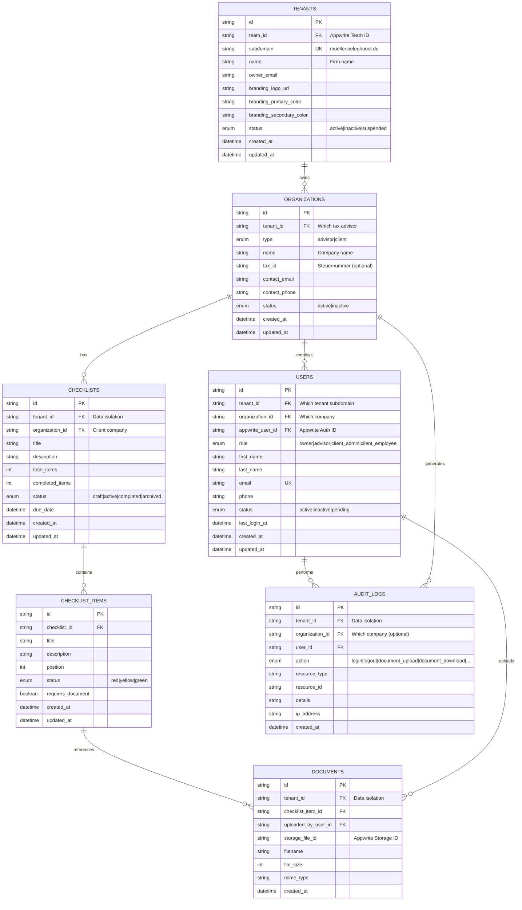

## 📋 Overview

BelegBoost is a multi-tenant B2B SaaS application designed for German tax advisors (Steuerberater) and their clients (Mandanten). The platform enables checklist management with document uploads and status tracking via a traffic light system. Each tax advisor operates their own branded subdomain (`[berater-domain].belegboost.de`) where both the advisor and their clients can log in to manage checklists and financial documents.

**Target Market:** German tax advisory firms (DACH region)
**Compliance:** GDPR, BDSG (German Federal Data Protection Act), BSI IT-Grundschutz
**Tech Stack:** Next.js 15, React 19, TypeScript, Tailwind CSS 4, shadcn/ui, Appwrite (self-hosted)
**Deployment:** Hetzner Germany (GDPR compliance)
**Timeline:** 18 weeks (4.5 months) across 7 implementation phases

> **⚠️ ARCHITECTURE UPDATE (2025-10-15):** Database schema revised to support multi-organization hierarchies. See [Architecture Revision PR #3](https://github.com/theofficialpopo/belegboost/pull/3) and [detailed documentation](https://github.com/theofficialpopo/belegboost/blob/feature/phase-2-authentication/docs/github-issue-architecture-revision.md).

---

## 🎯 Problem Statement

Tax advisors currently lack a centralized, secure platform to:
- Manage document collection from clients with clear status tracking
- Track checklist completion status with visual indicators (traffic light system)
- Provide clients with self-service document upload capabilities
- Maintain strict data isolation between different advisory firms
- Ensure GDPR compliance for sensitive financial data (10-year retention)

Each advisory firm needs their own branded portal without the complexity of managing separate deployments. The subdomain-based multi-tenancy approach provides tenant isolation while maintaining a single codebase and deployment.

---

## 💡 Proposed Solution

Build a greenfield Next.js 15 application with subdomain-based multi-tenancy using:
- **Frontend:** Next.js 15.5.5, TypeScript 5 (strict mode), Tailwind CSS 4, shadcn/ui
- **Backend:** Appwrite 1.5+ (Auth, Database, Storage) - self-hosted
- **Architecture:** Single deployment serving all tenants via middleware-based routing
- **Deployment:** Self-hosted on Hetzner Germany for full GDPR compliance

### Domain Structure
```
belegboost.de                           → Main landing + tax advisor registration
[berater-subdomain].belegboost.de      → Tax advisor portal with custom branding
```

**Example Flow:**
1. Tax advisor "Müller Steuerberatung" registers at `belegboost.de`
2. Chooses subdomain: `mueller`
3. Portal available at `mueller.belegboost.de` with custom logo and colors
4. Advisor creates client organizations (customer companies)
5. Advisor invites client employees who access the same subdomain
6. All data strictly isolated per tenant using Appwrite Teams API

---

## 🏗️ Technical Approach

### Multi-Tenancy Model

**Subdomain-Based Tenant Isolation:**
- Next.js 15 middleware detects subdomain from request headers
- Single Next.js deployment serves all tenants dynamically
- Appwrite Teams API provides backend tenant isolation
- Each query MUST filter by `tenant_id` (enforced via Data Access Layer)

**Multi-Organization Hierarchy:**
```
Tenant (Tax Advisor Firm)
  ↓
Organizations (type: advisor | client)
  ├─ Advisor Organization (the firm itself)
  │    └─ Users (owner, advisor)
  └─ Client Organizations (customer companies)
       └─ Users (client_admin, client_employee)
       └─ Checklists
```

### Database Schema (Appwrite Collections) - REVISED 2025-10-15

> **🔄 Architecture Update:** Schema revised to support multi-organization hierarchies. Each tenant can have multiple organizations (advisor firm + client companies), and each organization can have multiple users.



**Key Changes from Original Schema:**
- ✅ **NEW:** `organizations` collection (represents both advisor firms AND client companies)
- ✅ **UPDATED:** `users.organization_id` - Links users to organizations
- ✅ **UPDATED:** `users.role` - New roles: `owner | advisor | client_admin | client_employee`
- ✅ **UPDATED:** `checklists.organization_id` - Checklists assigned to client organizations
- ✅ **UPDATED:** `audit_logs.organization_id` - Organization-level auditing

**Index Strategy (Performance):**
- `tenant_id` on ALL collections (CRITICAL for query performance)
- `tenant_id + type` on organizations
- `tenant_id + organization_id` on users
- `tenant_id + organization_id + status` on checklists
- `tenant_id + action` on audit_logs

**See detailed schema:** [docs/github-issue-architecture-revision.md](https://github.com/theofficialpopo/belegboost/blob/feature/phase-2-authentication/docs/github-issue-architecture-revision.md)

---

## 📅 Implementation Phases

### Phase 1: Foundation (Weeks 1-3) 🏗️ - ✅ COMPLETED

**Status:** ✅ All tasks completed

**Completed:**
- ✅ Initialize Next.js 15 project with TypeScript strict mode
- ✅ Configure Git repository
- ✅ Set up Appwrite Cloud connection
- ✅ Configure middleware for subdomain detection
- ✅ Create base folder structure
- ✅ Install core dependencies
- ✅ Configure Tailwind CSS 4
- ✅ Create TypeScript type definitions

---

### Phase 2: Authentication & Multi-Tenancy Core (Weeks 4-6) 🔐 - 🔄 IN PROGRESS

**Goal:** Implement complete auth system with role-based access control

**Status:** 🔄 Database architecture revision completed, auth implementation in progress

**Completed:**
- ✅ Create Appwrite database collections (all 7 collections)
- ✅ Implement multi-organization architecture
- ✅ Update TypeScript type definitions

**In Progress:**
- 🔄 Build tax advisor registration flow
- 🔄 Create login flow
- 🔄 Implement role-based access control
- 🔄 Build client organization creation
- 🔄 Build client invitation system

**Tasks:**
- [ ] **Registration Flow (Main Domain):**
  - Create `/app/(main)/registrierung/page.tsx` with form
  - Build server action to:
    - Create Appwrite auth user
    - Create tenant record
    - Create advisor organization
    - Create user record with role='owner'
  - Validate subdomain uniqueness
  - Send welcome email

- [ ] **Login Flow (Tenant Subdomains):**
  - Create `/app/tenants/[tenant]/(auth)/login/page.tsx`
  - Build server action for authentication
  - Create session with tenant context
  - Redirect based on user role

- [ ] **Role-Based Access Control:**
  - Create middleware to verify tenant context
  - Build permission checking utilities
  - Implement route guards for different roles
  - Create higher-order components for protected pages

- [ ] **Client Organization Creation:**
  - Build UI for advisors to create client organizations
  - Server action to create organization with type='client'
  - Link to current tenant

- [ ] **Client User Invitation:**
  - Build invitation form for advisors
  - Create invitation tokens
  - Send invitation emails
  - Build invitation acceptance flow
  - Create user records with appropriate roles

- [ ] **Protected Routes:**
  - Implement auth middleware for all tenant routes
  - Add session validation
  - Handle unauthorized access
  - Redirect to login when needed

- [ ] **Logout:**
  - Build logout server action
  - Clear session cookies
  - Redirect to login page
  - Add logout button to UI

**Deliverables:**
- Complete authentication system
- Tax advisor registration working
- Multi-user login with tenant isolation
- Role-based dashboards
- Client organization and user management

---

### Phase 3: Checklist Management (Weeks 7-9) 📋

**Goal:** Build core checklist and checklist item functionality

**Tasks:**
- [ ] **Checklist CRUD:**
  - Create checklist list view (advisor view: all clients, client view: own checklists)
  - Build checklist creation form (advisors only)
  - Implement checklist editing
  - Add checklist deletion with confirmation
  - Filter/search checklists by organization, status, due date

- [ ] **Checklist Items:**
  - Add checklist item creation (within checklist detail view)
  - Implement drag-and-drop reordering
  - Build traffic light status update (red/yellow/green)
  - Add item description and document requirement toggle
  - Auto-update parent checklist progress on item status change

- [ ] **Data Access Layer:**
  - Create `lib/dal/checklists.ts` with tenant-filtered queries
  - Build server actions for all checklist operations
  - Ensure all queries include `tenant_id` filtering
  - Add proper error handling and validation

**Deliverables:**
- Working checklist management system
- Traffic light status tracking
- Progress calculation
- Tenant-isolated data access

---

### Phase 4: Document Upload & Storage (Weeks 10-12) 📄

**Goal:** Implement secure document handling with Appwrite Storage

**Tasks:**
- [ ] **Storage Setup:**
  - Create Appwrite storage bucket per tenant
  - Configure file type restrictions (PDF, JPG, PNG, XLSX, DOCX)
  - Set max file size (10MB)
  - Enable encryption

- [ ] **Upload Flow:**
  - Build file upload component with drag-and-drop
  - Validate file types (MIME + magic bytes)
  - Sanitize filenames
  - Create document metadata records
  - Link documents to checklist items
  - Show upload progress

- [ ] **Document Management:**
  - Build document list view (per checklist item)
  - Implement file download with audit logging
  - Add file deletion (with permission checks)
  - Show file metadata (size, type, upload date, uploader)

- [ ] **Security:**
  - Validate file types server-side
  - Check file size limits
  - Ensure tenant isolation for storage
  - Log all upload/download actions to audit_logs

**Deliverables:**
- Secure document upload system
- File type validation
- Tenant-scoped storage buckets
- Audit trail for all document operations

---

### Phase 5: GDPR Compliance & Legal (Weeks 13-14) ⚖️

**Goal:** Ensure full GDPR compliance and German legal requirements

**Tasks:**
- [ ] **Legal Pages:**
  - Create Impressum page (required by German law)
  - Create Datenschutzerklärung (privacy policy)
  - Create terms of service
  - Add cookie consent banner

- [ ] **Data Export:**
  - Build user data export functionality (JSON + ZIP)
  - Include all user documents in export
  - Generate audit logs of export actions

- [ ] **Account Deletion:**
  - Implement soft-delete for users
  - Preserve documents for 10 years (tax requirement)
  - Remove personal data while keeping anonymized records
  - Handle GDPR deletion requests within 30 days

- [ ] **Audit Logging:**
  - Log all sensitive actions (login, document upload/download, exports, deletions)
  - Store IP addresses
  - Create audit log viewer (admin only)

- [ ] **Security Headers:**
  - Configure CSP in `next.config.ts`
  - Add X-Frame-Options
  - Implement CSRF protection
  - Enable HSTS

**Deliverables:**
- GDPR-compliant data handling
- Legal pages in German
- User data export and deletion
- Complete audit logging

---

### Phase 6: UI/UX Polish & Tenant Branding (Weeks 15-16) 🎨

**Goal:** Professional UI with tenant customization

**Tasks:**
- [ ] **shadcn/ui Integration:**
  - Install and configure shadcn/ui
  - Build reusable components (buttons, forms, modals, tables)
  - Implement consistent styling

- [ ] **Tenant Branding:**
  - Add branding customization form (logo upload, primary/secondary colors)
  - Apply tenant colors via CSS custom properties
  - Show tenant logo in header
  - Preview branding changes

- [ ] **Responsive Design:**
  - Ensure all pages work on mobile/tablet
  - Build mobile-friendly navigation
  - Test on different screen sizes

- [ ] **Dashboard:**
  - Build advisor dashboard (overview of all clients, recent activity)
  - Build client dashboard (assigned checklists, recent documents)
  - Add statistics and progress charts

**Deliverables:**
- Professional UI with shadcn/ui
- Tenant branding customization
- Responsive design
- Role-specific dashboards

---

### Phase 7: Testing, Deployment & Launch (Weeks 17-18) 🚀

**Goal:** Production-ready deployment on Hetzner Germany

**Tasks:**
- [ ] **Testing:**
  - Write E2E tests for tenant isolation (critical!)
  - Test all authentication flows
  - Test document upload/download
  - Test GDPR compliance features
  - Load testing with multiple tenants

- [ ] **Deployment:**
  - Set up Hetzner server (Germany region)
  - Self-host Appwrite instance
  - Configure DNS for wildcard subdomains (*.belegboost.de)
  - Set up SSL certificates
  - Configure backups

- [ ] **Monitoring:**
  - Set up error tracking
  - Configure logging
  - Add uptime monitoring
  - Create backup schedules

- [ ] **Documentation:**
  - Write user documentation (German)
  - Create admin guides
  - Document deployment process
  - Add troubleshooting guides

**Deliverables:**
- Production deployment on Hetzner
- SSL certificates
- Monitoring and backups
- User documentation

---

## 🔐 Security & Compliance Checklist

- [ ] All database queries filter by `tenant_id`
- [ ] File uploads validate MIME types AND magic bytes
- [ ] Appwrite hosted on Hetzner Germany (GDPR)
- [ ] Impressum and Datenschutzerklärung pages (German legal requirement)
- [ ] User data export functionality (GDPR Article 20)
- [ ] Account deletion with 10-year document retention
- [ ] Audit logs for all sensitive operations
- [ ] CSP and security headers configured
- [ ] E2E tests for tenant isolation
- [ ] Rate limiting on auth endpoints

---

## 📚 References

### Internal References
- CLAUDE.md: Team conventions
- docs/prd.md: German product requirements
- **docs/github-issue-architecture-revision.md:** Complete architecture revision documentation
- **PR #3:** Multi-organization architecture implementation

### External References
- Next.js 15: https://nextjs.org/docs
- Appwrite: https://appwrite.io/docs
- GDPR: https://gdpr.eu/
- German BDSG: https://www.gesetze-im-internet.de/bdsg_2018/

---

**Phase 1 Status:** ✅ COMPLETED
**Phase 2 Status:** 🔄 IN PROGRESS (Architecture revision completed)

**Ready for Implementation!** 🚀
