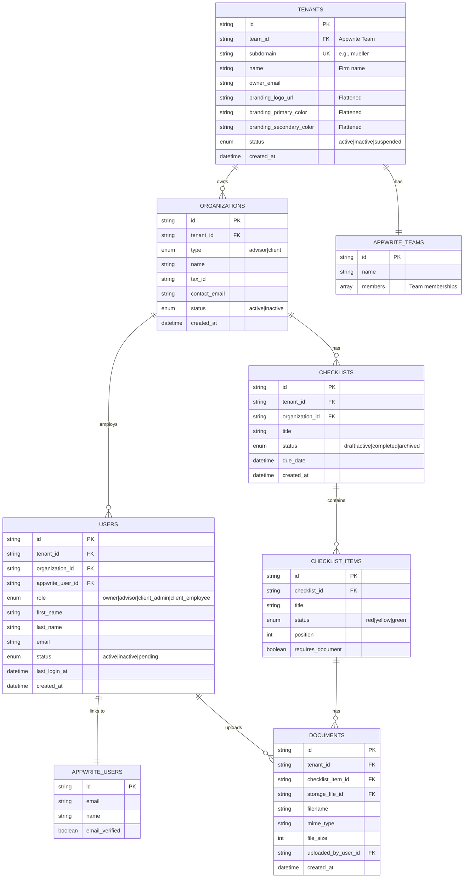

# fix: Align TypeScript Types with Appwrite Auto-Generated Schema

## 🎯 Overview

Critical type mismatch discovered during tax advisor registration flow. The manual TypeScript types in `src/types/tenant.ts` don't match the auto-generated Appwrite schema in `src/types/appwrite.ts`, causing runtime errors when creating tenant records.

**Current Status**: Registration fails with "Unknown attribute: branding" error. Only Appwrite Auth user is created; tenant, organization, and user profile records fail to save.

**Root Cause**:
- Manual types use nested `branding?: TenantBranding` object
- Database schema uses flattened fields: `branding_logo_url`, `branding_primary_color`, `branding_secondary_color`
- Status enum mismatch: Code uses `'trial'`, database accepts `'active' | 'inactive' | 'suspended'`

## 🐛 Problem Statement

### Error Details

```bash
Error creating tenant: AppwriteException: Invalid document structure: Unknown attribute: "branding"
    at async createTenant (src\lib\dal\tenants.ts:129:20)
    at async registerTaxAdvisor (src\actions\auth.ts:132:16)

  code: 400,
  type: 'document_invalid_structure'
```

### What's Happening

1. ✅ Appwrite Auth user created successfully (`68eff48b0012d39c069c`)
2. ✅ Appwrite Team created successfully
3. ❌ **Tenant record fails** - Unknown attribute "branding"
4. ❌ Organization record not created (cascade failure)
5. ❌ User profile not created (cascade failure)

### Files Affected

**Type Definitions:**
- `src/types/tenant.ts` - Manual types with nested branding
- `src/types/appwrite.ts` - Auto-generated types with flat branding (UNUSED)
- `src/types/organization.ts` - Enum mismatch between this and DAL

**Data Access Layer:**
- `src/lib/dal/tenants.ts` - Creates `branding: {}` object (fails)
- `src/lib/dal/organizations.ts` - Has conflicting `OrganizationType` enum

**Actions:**
- `src/actions/auth.ts` - Registration flow using incorrect types

**Database Config:**
- `appwrite.config.json` - Source of truth for schema

---

## 🔍 Research Findings

### 1. Repository Pattern Analysis

**Current Type Organization** (from repo-research-analyst):

```
src/types/
├── appwrite.ts          # Auto-generated (UNUSED) ❌
├── tenant.ts            # Manual types (MISMATCHED) ❌
├── organization.ts      # Manual types ✓
├── user.ts              # Manual types ✓
└── checklist.ts         # Manual types ✓
```

**Key Issues Found:**

1. **Auto-generated types completely unused** - `appwrite.ts` exists but no imports
2. **Enum naming collisions** - Multiple `Status` enums in auto-generated file
3. **OrganizationType inconsistency**:
   - `src/types/organization.ts:15`: `'advisor' | 'client'`
   - `src/lib/dal/organizations.ts:17`: `'advisor_firm' | 'client_company'`
4. **Pattern inconsistency** - Tenant doesn't follow same Create/Update pattern as User/Organization

**Established Pattern (User, Organization, Checklist):**
```typescript
export interface Entity {
  $id: string;
  tenant_id: string;
  // ... fields
  $createdAt: string;
  $updatedAt: string;
}

export type CreateEntity = Omit<Entity, '$id' | '$createdAt' | '$updatedAt'>;
export type UpdateEntity = Partial<Omit<Entity, '$id' | '$createdAt' | '$updatedAt'>> & { $id: string };
```

**Tenant Type (Different - Needs Alignment):**
```typescript
// No CreateTenant/UpdateTenant utility types
// Has custom CreateTenantInput, UpdateTenantBrandingInput
// Nested branding object (doesn't match database)
```

### 2. Appwrite Best Practices (from best-practices-researcher)

**Type Generation Workflow:**
```bash
# 1. Pull schema from Appwrite
appwrite pull collections

# 2. Generate TypeScript types
appwrite types ./src/types/appwrite.ts --strict

# 3. Import and use
import type { Tenants, Users, Organizations } from '@/types/appwrite';
```

**Recommended Type Structure:**
```typescript
// Auto-generated (DO NOT EDIT)
// src/types/appwrite.ts
export type Tenants = Models.Row & {
    team_id: string;
    subdomain: string;
    name: string;
    owner_email: string;
    branding_logo_url: string | null;      // Flattened
    branding_primary_color: string | null;
    branding_secondary_color: string | null;
    status: Status; // 'active' | 'inactive' | 'suspended'
}

// Custom extensions (CAN EDIT)
// src/types/database.ts
import type { Tenants } from './appwrite';

export type TenantWithCounts = Tenants & {
  user_count: number;
  checklist_count: number;
};

export type CreateTenantInput = Omit<Tenants, keyof Models.Row>;
```

**Data Access Layer Pattern:**
```typescript
import type { Tenants } from '@/types/appwrite';

export async function createTenant(data: {
  teamId: string;
  subdomain: string;
  name: string;
  ownerEmail: string;
}): Promise<Tenants> {
  return await databases.createDocument<Tenants>(
    DATABASE_ID,
    COLLECTIONS.TENANTS,
    'unique()',
    {
      team_id: data.teamId,
      subdomain: data.subdomain,
      name: data.name,
      owner_email: data.ownerEmail,
      branding_logo_url: null,        // Flat fields
      branding_primary_color: null,
      branding_secondary_color: null,
      status: 'active',                // Valid enum value
    }
  );
}
```

### 3. Multi-Tenancy Architecture Validation (from framework-docs-researcher)

**✅ CONFIRMED: One Team per Tenant is Correct**

Based on Appwrite official documentation and community research:

**Appwrite Teams Purpose (Authentication Boundary):**
- One Team per tenant (tax advisor firm)
- Maps to subdomain (e.g., mueller.belegboost.de)
- All users (advisors + clients) are Team members
- Provides authentication and permission management

**Organizations Purpose (Business Entity Boundary):**
- Multiple per tenant (advisor firm + client companies)
- Stored in `organizations` collection
- Users belong to organizations via `organization_id`
- Data isolation via `tenant_id` + `organization_id` filtering

**Why NOT Separate Teams for Clients:**

❌ **Separate Teams Per Client** would cause:
1. Complex authentication (which Team to log in to?)
2. Permission nightmare (advisor accessing multiple Teams)
3. Can't query "all checklists across my clients"
4. Wrong abstraction (Teams = isolated projects, not sub-entities)
5. Breaks subdomain model (one subdomain = one Team)

✅ **One Team with Organizations** provides:
1. Single authentication flow at tenant subdomain
2. Advisor sees all client data (business requirement)
3. Simple permission model (Team = access, role = capabilities)
4. Natural hierarchy (advisor owns, clients are guests)
5. Matches B2B SaaS model (advisor is paying customer)

**Real-World Analogy:** Think of Slack workspaces
- Workspace = Team (one per company)
- Channels = Organizations (departments, projects)
- You don't create separate Slack workspaces for each channel!

**Pattern Used By:**
- Gusto (payroll): Company owns, employees are users
- QuickBooks Online Accountant: Accountant owns, clients managed
- DocuSign: Account owner invites clients

---

## 📋 Proposed Solution

### Strategy: Hybrid Approach

Use **auto-generated types as source of truth** with **custom type extensions** for business logic.

```
src/types/
├── appwrite.ts          # Auto-generated (source of truth)
├── database.ts          # Custom extensions & utility types
├── api.ts               # API request/response types
└── index.ts             # Convenient re-exports
```

### Implementation Plan

#### Phase 1: Fix Immediate Type Mismatches

**Files to Modify:**

1. **src/lib/dal/tenants.ts**
   - Import `Tenants` from `@/types/appwrite`
   - Remove nested `branding: {}` object
   - Use flat branding fields
   - Change status from `'trial'` to `'active'`

2. **src/lib/server/tenant.ts**
   - Import `Tenants` from `@/types/appwrite`
   - Update return types

3. **src/actions/auth.ts**
   - Import `Tenants` from `@/types/appwrite`
   - Update type annotations

4. **src/types/tenant.ts**
   - Either delete OR refactor to re-export Appwrite types
   - Keep helper types (CreateTenantInput, etc.)

**Changes:**

```typescript
// Before (src/lib/dal/tenants.ts:122-148)
import type { Tenant } from '@/types/tenant';

export async function createTenant(data: {
  teamId: string;
  subdomain: string;
  name: string;
  ownerEmail: string;
}): Promise<Tenant> {
  const tenant = await databases.createDocument<Tenant>(
    DATABASE_ID,
    COLLECTIONS.TENANTS,
    'unique()',
    {
      team_id: data.teamId,
      subdomain: data.subdomain,
      name: data.name,
      owner_email: data.ownerEmail,
      branding: {},              // ❌ FAILS
      status: 'trial',           // ❌ NOT IN ENUM
    }
  );
  return tenant;
}

// After
import type { Tenants } from '@/types/appwrite';

export async function createTenant(data: {
  teamId: string;
  subdomain: string;
  name: string;
  ownerEmail: string;
}): Promise<Tenants> {
  const tenant = await databases.createDocument<Tenants>(
    DATABASE_ID,
    COLLECTIONS.TENANTS,
    'unique()',
    {
      team_id: data.teamId,
      subdomain: data.subdomain,
      name: data.name,
      owner_email: data.ownerEmail,
      branding_logo_url: null,        // ✅ Flat field
      branding_primary_color: null,   // ✅ Flat field
      branding_secondary_color: null, // ✅ Flat field
      status: 'active',                // ✅ Valid enum
    }
  );
  return tenant;
}
```

```typescript
// Before (src/lib/dal/tenants.ts:157-180)
export async function updateTenantBranding(
  tenantId: string,
  branding: {
    logoUrl?: string;
    primaryColor?: string;
    secondaryColor?: string;
  }
): Promise<Tenant> {
  const tenant = await databases.updateDocument<Tenant>(
    DATABASE_ID,
    COLLECTIONS.TENANTS,
    tenantId,
    { branding }  // ❌ Nested object
  );
  return tenant;
}

// After
export async function updateTenantBranding(
  tenantId: string,
  branding: {
    branding_logo_url?: string | null;
    branding_primary_color?: string | null;
    branding_secondary_color?: string | null;
  }
): Promise<Tenants> {
  const tenant = await databases.updateDocument<Tenants>(
    DATABASE_ID,
    COLLECTIONS.TENANTS,
    tenantId,
    branding  // ✅ Flat fields
  );
  return tenant;
}
```

#### Phase 2: Fix OrganizationType Inconsistency

**Critical Issue**: Two conflicting definitions

```typescript
// src/types/organization.ts:15
export type OrganizationType = 'advisor' | 'client';

// src/lib/dal/organizations.ts:17 (WRONG)
export type OrganizationType = 'advisor_firm' | 'client_company';
```

**Fix**: Remove duplicate from DAL, import from types file

```typescript
// src/lib/dal/organizations.ts
import type { Organization, OrganizationType } from '@/types/organization';
// Remove: export type OrganizationType = ...
```

#### Phase 3: Refactor Type Organization

**Create src/types/database.ts** for custom extensions:

```typescript
/**
 * Custom database type extensions
 * Business logic types that extend auto-generated Appwrite types
 */
import type { Tenants, Users, Organizations, Checklists } from './appwrite';

// Tenant extensions
export type TenantWithCounts = Tenants & {
  user_count: number;
  checklist_count: number;
  client_count: number;
};

export type CreateTenantInput = Omit<Tenants, keyof Models.Row>;
export type UpdateTenantBrandingInput = Pick<
  Tenants,
  'branding_logo_url' | 'branding_primary_color' | 'branding_secondary_color'
>;

// User extensions (keep from existing user.ts)
export { UserRole, UserStatus, User, CreateUser, UpdateUser } from './user';

// Helper functions (keep)
export { isAdvisorRole, isClientRole, isAdminRole } from './user';
```

**Update src/types/index.ts**:

```typescript
// Re-export all types for convenient imports
export type {
  Tenants,
  Users,
  Organizations,
  Checklists,
  ChecklistItems,
  Documents,
  AuditLogs,
} from './appwrite';

export type {
  TenantWithCounts,
  CreateTenantInput,
  UpdateTenantBrandingInput,
} from './database';

export type {
  UserRole,
  UserStatus,
  CreateUser,
  UpdateUser,
  TenantContext,
} from './user';

export { isAdvisorRole, isClientRole, isAdminRole } from './user';
```

#### Phase 4: Add Type Generation to Development Workflow

**Update package.json:**

```json
{
  "scripts": {
    "types:pull": "appwrite pull collections",
    "types:generate": "appwrite types ./src/types/appwrite.ts --strict",
    "types:sync": "npm run types:pull && npm run types:generate",
    "types:check": "tsc --noEmit",
    "precommit": "npm run types:check"
  }
}
```

**Add to .husky/pre-commit** (if using Husky):

```bash
#!/bin/sh
npm run types:check
```

#### Phase 5: Update Documentation

**Add to CLAUDE.md** (after line 169):

```markdown
## Type Management

### Auto-Generated Types

**Source of Truth**: `src/types/appwrite.ts` (auto-generated from database schema)

**Regenerate Types:**
```bash
# Pull latest schema from Appwrite
npm run types:pull

# Generate TypeScript types
npm run types:generate

# Or do both at once
npm run types:sync
```

**NEVER manually edit** `src/types/appwrite.ts` - changes will be overwritten.

### Custom Type Extensions

**Location**: `src/types/database.ts`

Use this file for:
- Derived types (e.g., `TenantWithCounts`)
- Create/Update utility types
- Business logic type transformations

### Type Import Pattern

```typescript
// Good: Import from index for convenience
import type { Tenants, CreateTenantInput } from '@/types';

// Also good: Import directly when needed
import type { Tenants } from '@/types/appwrite';

// Bad: Import from appwrite.ts directly (bypasses index)
import type { Tenants } from '@/types/appwrite.ts';
```

### Teams vs Organizations Architecture

**Appwrite Teams** (Authentication Boundary):
- One Team per tenant (tax advisor firm)
- Maps to subdomain (e.g., mueller.belegboost.de)
- All users (advisors + clients) are Team members
- Provides authentication and top-level access control

**Organizations** (Business Entity Boundary):
- Multiple per tenant (advisor firm + client companies)
- Stored in `organizations` collection
- Users belong to organizations via `organization_id`
- Data isolation via `tenant_id` + `organization_id` filtering

**Why Not Separate Teams for Clients?**
- Clients are guests in advisor's system, not independent tenants
- Single auth flow at tenant subdomain
- Advisor needs cross-organization visibility
- Matches B2B SaaS model (advisor pays, clients are managed)
- Simpler permissions, invitations, and queries

**Reference:** See Slack's workspace model - one workspace (Team) with many channels (Organizations).
```

---

## ✅ Acceptance Criteria

### Functional Requirements

- [ ] Registration completes successfully end-to-end
- [ ] Tenant record created with flat branding fields (all null initially)
- [ ] Tenant status is `'active'` (not `'trial'`)
- [ ] Organization record created for advisor firm
- [ ] User profile record created with correct references
- [ ] All DAL functions use `Tenants` from `@/types/appwrite`
- [ ] OrganizationType enum consistent across codebase
- [ ] Type imports consistent (from `@/types` or `@/types/appwrite`)

### Non-Functional Requirements

- [ ] TypeScript strict mode passes (`npm run types:check`)
- [ ] No ESLint errors (`npm run lint`)
- [ ] Build succeeds (`npm run build`)
- [ ] Auto-generated types have header warning against manual edits
- [ ] Documentation updated in CLAUDE.md

### Testing Requirements

- [ ] Test registration with new types
- [ ] Test login flow still works
- [ ] Verify tenant record structure in Appwrite console
- [ ] Verify organization record created
- [ ] Verify user profile record created
- [ ] Test branding update function with flat fields

---

## 🗂️ Files to Modify

### Primary Changes

1. ✏️ **src/lib/dal/tenants.ts** (Lines 13, 122-148, 157-180)
   - Change imports to use `Tenants` from `@/types/appwrite`
   - Fix `createTenant()` to use flat branding fields
   - Fix status to use `'active'` instead of `'trial'`
   - Fix `updateTenantBranding()` parameter signature and implementation

2. ✏️ **src/lib/dal/organizations.ts** (Line 17)
   - Remove duplicate `OrganizationType` definition
   - Import from `@/types/organization` instead

3. ✏️ **src/lib/server/tenant.ts** (Line 14)
   - Import `Tenants` from `@/types/appwrite`
   - Update `getTenantContext()` return type

4. ✏️ **src/actions/auth.ts** (Lines with Tenant type usage)
   - Import `Tenants` from `@/types/appwrite`
   - Update type annotations in `registerTaxAdvisor()`

### Type Organization (New Files)

5. ✨ **src/types/database.ts** (NEW)
   - Custom type extensions
   - Create/Update utility types
   - Business logic types

6. ✏️ **src/types/index.ts** (UPDATE or CREATE)
   - Re-export all types for convenient imports
   - Single source of truth for type imports

7. ✏️ **src/types/tenant.ts** (REFACTOR or DELETE)
   - Option A: Delete entirely, move helpers to database.ts
   - Option B: Keep as thin wrapper that re-exports Appwrite types

### Documentation

8. ✏️ **CLAUDE.md** (After line 169)
   - Add "Type Management" section
   - Add "Teams vs Organizations Architecture" explanation
   - Document type generation workflow

9. ✏️ **package.json** (scripts section)
   - Add type generation scripts
   - Add pre-commit type check

### Optional (Future Enhancement)

10. ⚠️ **appwrite.config.json** (Lines 220-230)
    - Consider adding `"trial"` to status enum if needed
    - OR use `'active'` with separate trial tracking (recommended)

---

## 🎯 Success Metrics

### Before Fix

```bash
❌ Registration: 0% success rate
❌ Tenant records: 0 created
❌ Organization records: 0 created
❌ User profile records: 0 created
✅ Appwrite Auth users: Created (orphaned)
```

### After Fix

```bash
✅ Registration: 100% success rate
✅ Tenant records: Created with correct schema
✅ Organization records: Created successfully
✅ User profile records: Created successfully
✅ Type safety: All database operations type-safe
✅ Build: Passes without errors
```

---

## 🚀 Implementation Steps

### Step 1: Fix Immediate Registration Blocker

```bash
# 1. Update src/lib/dal/tenants.ts
# 2. Update imports in server/tenant.ts and actions/auth.ts
# 3. Test registration flow
# 4. Verify all records created
```

### Step 2: Fix OrganizationType Inconsistency

```bash
# 1. Remove duplicate from dal/organizations.ts
# 2. Import from types/organization.ts
# 3. Run type check
```

### Step 3: Reorganize Type Files

```bash
# 1. Create src/types/database.ts
# 2. Create src/types/index.ts
# 3. Update all imports across codebase
# 4. Delete or refactor src/types/tenant.ts
```

### Step 4: Add Development Workflow

```bash
# 1. Update package.json with type scripts
# 2. Add pre-commit hook (optional)
# 3. Document in CLAUDE.md
```

### Step 5: Testing & Validation

```bash
# 1. Clear orphaned test users from Appwrite
# 2. Test registration end-to-end
# 3. Verify database records
# 4. Test login flow
# 5. Run full build
```

---

## 📚 Dependencies & Prerequisites

### Required

- ✅ Appwrite instance running (fra.cloud.appwrite.io)
- ✅ Database collections already created
- ✅ Valid API key configured
- ✅ Appwrite CLI installed (`npm install -g appwrite-cli`)

### Optional

- [ ] Husky for git hooks (type checking)
- [ ] Zod for runtime validation (future enhancement)

---

## ⚠️ Risks & Mitigations

### Risk 1: Breaking Existing Code

**Impact**: Other parts of codebase might still import old `Tenant` type

**Mitigation**:
- Search codebase for all `import.*Tenant` occurrences
- Update all imports systematically
- Run type check after each change
- Test affected flows

### Risk 2: Data Migration Needed

**Impact**: If branding data already exists in wrong format

**Mitigation**:
- Check Appwrite console for existing tenant records
- Currently none exist (registration fails)
- No migration needed for fresh start

### Risk 3: Auto-Generated Type Overwrite

**Impact**: Manually editing `appwrite.ts` will be lost

**Mitigation**:
- Add header comment warning against manual edits
- Keep custom types in separate file (`database.ts`)
- Document workflow in CLAUDE.md

---

## 🔗 References & Research

### Internal References

- **Type Files**: `src/types/` directory
- **DAL Files**: `src/lib/dal/` directory
- **Config**: `appwrite.config.json:156-231` (tenants collection)
- **Auto-gen Types**: `src/types/appwrite.ts:74-83` (Tenants type)

### External References

- **Appwrite Type Generation**: https://appwrite.io/docs/products/databases/type-generation
- **Appwrite Multi-Tenancy**: https://appwrite.io/docs/products/auth/multi-tenancy
- **Teams API**: https://appwrite.io/docs/server/teams
- **Permissions Guide**: https://appwrite.io/docs/advanced/platform/permissions
- **node-appwrite SDK**: https://www.npmjs.com/package/node-appwrite

### Related Work

- **Phase 1 PR**: #2 (Foundation - Multi-Tenant Architecture)
- **Phase 2 PR**: #4 (Authentication & Multi-Tenancy Core)
- **Architecture Doc**: Removed from repo (8a07e75)
- **Recent Commits**: 42e2c21 (shadcn UI improvements)

---

## 🔧 Implementation Checklist

### Phase 1: Quick Fix (Registration Blocker)

- [ ] Update `src/lib/dal/tenants.ts` imports
- [ ] Fix `createTenant()` to use flat branding
- [ ] Change status from `'trial'` to `'active'`
- [ ] Update `updateTenantBranding()` signature
- [ ] Update `src/lib/server/tenant.ts` imports
- [ ] Update `src/actions/auth.ts` imports
- [ ] Test registration flow end-to-end
- [ ] Verify all database records created

### Phase 2: Type Consistency

- [ ] Fix OrganizationType duplicate in `dal/organizations.ts`
- [ ] Run `npm run types:check`
- [ ] Run `npm run lint`
- [ ] Fix any remaining type errors

### Phase 3: Type Organization

- [ ] Create `src/types/database.ts`
- [ ] Create `src/types/index.ts`
- [ ] Refactor or delete `src/types/tenant.ts`
- [ ] Update all imports to use new structure
- [ ] Verify no broken imports

### Phase 4: Development Workflow

- [ ] Add scripts to `package.json`
- [ ] Test type generation workflow
- [ ] Add pre-commit hook (optional)
- [ ] Update CLAUDE.md documentation

### Phase 5: Final Validation

- [ ] Run full build (`npm run build`)
- [ ] Test registration (create new tenant)
- [ ] Test login (existing tenant)
- [ ] Test tenant branding update
- [ ] Verify type safety in IDE
- [ ] Commit changes with descriptive message

---

## 📊 Database Schema Reference

### Tenants Collection (appwrite.config.json:149-244)

```json
{
  "$id": "tenants",
  "columns": [
    { "key": "team_id", "type": "string", "required": true, "size": 36 },
    { "key": "subdomain", "type": "string", "required": true, "size": 50 },
    { "key": "name", "type": "string", "required": true, "size": 200 },
    { "key": "owner_email", "type": "string", "required": true, "format": "email" },
    { "key": "branding_logo_url", "type": "string", "required": false, "size": 500 },
    { "key": "branding_primary_color", "type": "string", "required": false, "size": 7 },
    { "key": "branding_secondary_color", "type": "string", "required": false, "size": 7 },
    {
      "key": "status",
      "type": "string",
      "required": true,
      "elements": ["active", "inactive", "suspended"],
      "format": "enum"
    }
  ],
  "indexes": [
    { "key": "subdomain_unique", "type": "unique", "columns": ["subdomain"] }
  ]
}
```

**Key Points:**
- ✅ Branding fields are FLATTENED (not nested object)
- ✅ All branding fields are OPTIONAL (null allowed)
- ⚠️ Status enum does NOT include "trial"
- ✅ Subdomain has unique index

---

## 🎨 ERD: Multi-Tenant Data Model



**Key Relationships:**
1. **Tenant → Team** (1:1): One Appwrite Team per tenant for auth
2. **Tenant → Organizations** (1:N): Advisor firm + multiple clients
3. **Organization → Users** (1:N): Employees of companies
4. **Organization → Checklists** (1:N): Client work items
5. **User → Appwrite User** (1:1): Links to auth system

---

## 📝 Summary

This comprehensive issue documents:
- ✅ Critical type mismatch blocking registration
- ✅ Research from 3 specialized agents (repo, best practices, framework docs)
- ✅ Architecture validation (one Team per tenant confirmed correct)
- ✅ Detailed implementation plan with 5 phases
- ✅ Complete file reference with line numbers
- ✅ ERD diagram for data model
- ✅ Acceptance criteria and testing checklist

**Priority**: 🔴 Critical - Blocks all new tenant registrations

**Estimated Effort**: ~2 hours for complete implementation

**Labels**: `bug`, `type-safety`, `phase-2`, `critical`
